# Sync Project

Unified command that:
1. Fetches all issues and PRs
2. **Automatically parses dependencies** from issue bodies (no hardcoding!)
3. Syncs GitHub Project board status
4. Updates the dependency graph with mermaid diagrams
5. Shows Kanban board and ready-to-start issues

---

## Phase 1: Gather All Data

### 1.1 Fetch All Issues (with bodies for dependency parsing)

```bash
gh issue list --limit 100 --state all --json number,title,body,labels,state,closedAt
```

### 1.2 Fetch Recent PRs

```bash
gh pr list --limit 20 --state all --json number,title,state,mergedAt,headRefName,labels
```

### 1.3 Fetch GitHub Project State

```bash
gh project item-list 1 --owner $(gh repo view --json owner -q '.owner.login') --format json
```

### 1.4 Fetch Issues from Related Repositories

For cross-repo dependency tracking:

```bash
# tied-siren-blocking-overlay
gh issue list --repo amehmeto/tied-siren-blocking-overlay --state all --json number,title,body,state --limit 50

# expo-foreground-service
gh issue list --repo amehmeto/expo-foreground-service --state all --json number,title,body,state --limit 20

# expo-accessibility-service
gh issue list --repo amehmeto/expo-accessibility-service --state all --json number,title,body,state --limit 20
```

---

## Phase 2: Parse Dependencies from Issue Bodies

### 2.1 Dependency Patterns to Detect

Parse the issue body for these patterns (case-insensitive):

| Pattern | Example | Extracted |
|---------|---------|-----------|
| YAML frontmatter | `depends_on: [177, 178]` | `[177, 178]` |
| Inline depends | `Depends on #123` | `[123]` |
| Blocked by | `Blocked by #123, #124` | `[123, 124]` |
| After | `After #123` | `[123]` |
| Requires | `Requires #123` | `[123]` |
| Blocks | `blocks: [184, 185]` | reverse dep |

### 2.2 Parsing Algorithm

```
For each issue:
  1. Check for YAML frontmatter block (```yaml ... ```)
  2. Extract `depends_on: [...]` array
  3. Extract `blocks: [...]` array (reverse dependencies)
  4. Scan body for inline patterns: "depends on #X", "blocked by #X"
  5. Store: { number, title, repo, state, depends_on[], blocks[] }
```

### 2.3 Build Dependency Graph

```
dependencies = {}
for each issue:
  dependencies[issue.number] = {
    title: issue.title,
    repo: issue.repo,
    state: issue.state,
    depends_on: parsed_depends_on,
    blocks: parsed_blocks,
    status: null  # computed next
  }
```

---

## Phase 3: Compute Issue Status

For each issue, determine status based on dependencies:

| Status | Criteria |
|--------|----------|
| `done` | Issue state is CLOSED |
| `ready` | All `depends_on` issues are CLOSED |
| `blocked` | At least one `depends_on` issue is OPEN |
| `in-progress` | Has `in-progress` label OR has open PR |

### 3.1 Topological Sort

Sort issues by dependency order to identify:
- **Phase 1**: Issues with no dependencies (can start now)
- **Phase 2**: Issues whose deps are all in Phase 1
- **Phase 3+**: Subsequent phases

---

## Phase 4: Sync Project Board

### 4.1 Identify Mismatches

Compare computed status with project board status:

| Computed | Board | Action |
|----------|-------|--------|
| done | Todo/In Progress | Move to Done |
| ready | null | Add to project, set Todo |
| in-progress | Todo | Move to In Progress |
| blocked | In Progress | Flag for review |

### 4.2 Generate Proposed Updates

```markdown
## Proposed Board Updates

### Issues to Close
- [ ] #XXX - Completed by PR #YYY

### Status Changes
- [ ] #XXX - Move from "Todo" → "In Progress" (has open PR)
- [ ] #XXX - Move from "In Progress" → "Done" (closed)

### Add to Project
- [ ] #XXX - Not in project, should be added as "Todo"
```

### 4.3 Confirmation Gate

**Ask user before making changes** using AskUserQuestion tool.

---

## Phase 5: Update Dependency Graph File

Write to `docs/dependency-graph.md`:

### 5.1 Header

```markdown
# Issue Dependency Graph

> Last updated: [TODAY]
> Auto-generated by `/sync-project`
> Dependencies parsed from issue bodies (no hardcoding)
```

### 5.2 Generate Mermaid Diagrams

For each work stream, generate a flowchart:

```mermaid
flowchart TD
    I177["#177 ✓ Title<br/>📦 repo-name"]
    I178["#178 ✓ Title<br/>📦 repo-name"]
    I179["#179 🔄 Title<br/>📦 repo-name"]

    I177 --> I180
    I178 --> I180
    I179 --> I180

    style I177 fill:#90EE90
    style I178 fill:#90EE90
    style I179 fill:#87CEEB
```



Color scheme:
- `#90EE90` Green - Done or Ready
- `#87CEEB` Blue - In Progress
- `#FFD700` Yellow - Has some deps
- `#FFA500` Orange - Multiple deps
- `#FF6B6B` Red - Blocked/Cleanup
- `#DDA0DD` Purple - Has dependencies

### 5.3 Work Streams Summary Table

```markdown
| Stream | Ready Now | In Progress | Blocked | Done |
|--------|-----------|-------------|---------|------|
| Blocking | #182 | #179 | #180 | #177, #178 |
| Auth | #88, #164 | #89 | #162 | #85-87 |
```

### 5.4 Raw Dependency Data

Output the parsed YAML for verification:

```yaml
# Auto-parsed from issue bodies
177:
  repo: TiedSiren51
  depends_on: []
  status: done
178:
  repo: TiedSiren51
  depends_on: []
  status: done
180:
  repo: TiedSiren51
  depends_on: [177, 178, 179]
  status: blocked
```

---

## Phase 6: Display Results

### 6.1 Kanban Board

```markdown
# Kanban Board

## 🟢 Ready to Start
| # | Title | Repo | Blocked By |
|---|-------|------|------------|
| #182 | AndroidSirenTier | blocking-overlay | — |

## 🔵 In Progress
| # | Title | Repo | PR |
|---|-------|------|-----|
| #179 | selectBlockingSchedule | TiedSiren51 | #197 |

## 🟡 Blocked
| # | Title | Blocked By |
|---|-------|------------|
| #180 | Unified listener | #179 |

## ✅ Recently Done
| # | Title | Closed |
|---|-------|--------|
| #178 | SirenLookout port | 2026-01-02 |
```

### 6.2 Dependency Visualization

Show the mermaid live link for the full pipeline diagram.

### 6.3 Health Metrics

```markdown
| Metric | Value |
|--------|-------|
| Total Open Issues | X |
| Ready to Start | Y |
| Blocked | Z |
| Missing Dependencies | W (issues with unparseable deps) |
| Cross-repo Issues | N |
```

---

## Issue Body Template

For new issues, recommend this template:

```markdown
## Description
[Issue description]

## Dependencies
<!--
Add dependencies in YAML frontmatter OR inline:
-->

```yaml
depends_on: [177, 178]
blocks: [184]
```

OR inline: Depends on #177, #178. Blocks #184.

## Acceptance Criteria
- [ ] ...
```

---

## Quick Reference

### Commands Used

```bash
# Fetch issues with bodies
gh issue list --state all --json number,title,body,labels,state,closedAt --limit 100

# Fetch from other repos
gh issue list --repo amehmeto/tied-siren-blocking-overlay --state all --json number,title,body,state

# Update project item status (requires item ID)
gh project item-edit --project-id PROJECT_ID --id ITEM_ID --field-id FIELD_ID --single-select-option-id OPTION_ID
```

### Repository Mapping

| Abbreviation | Full Name |
|--------------|-----------|
| TiedSiren51 | amehmeto/TiedSiren51 |
| blocking-overlay | amehmeto/tied-siren-blocking-overlay |
| expo-accessibility-service | amehmeto/expo-accessibility-service |
| expo-foreground-service | amehmeto/expo-foreground-service |

---

## Important Notes

- **No hardcoded dependencies** - everything is parsed from issue bodies
- **Cross-repo support** - tracks issues across all TiedSiren repositories
- **Confirmation required** - always ask before making changes
- **Mermaid diagrams** - auto-generated with repo info on each node
- Run regularly to keep project state accurate
