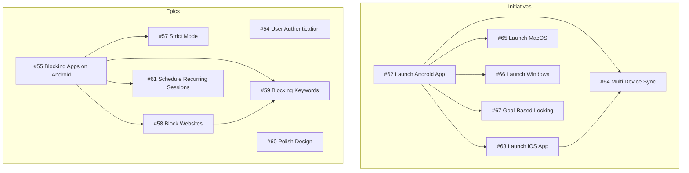
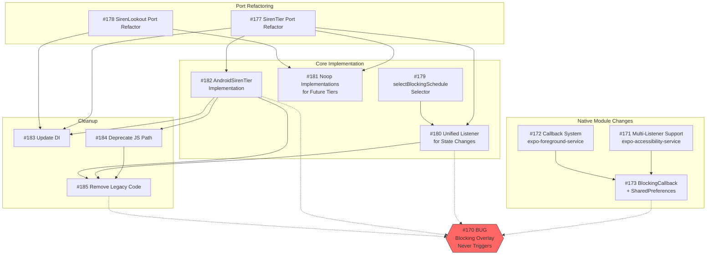
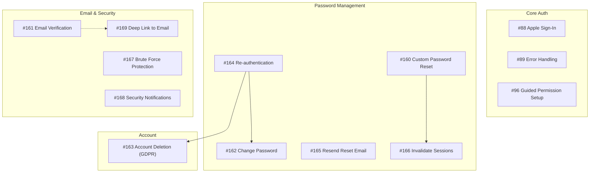

# Ticket Dependency Graph

This document visualizes the dependencies between GitHub issues to help with planning and prioritization.

## Overview



## Epic #55: Blocking Apps on Android - Fix Architecture

This epic addresses the critical bug #170 where blocking doesn't work when the app is backgrounded.



## Epic #54: User Authentication



## Recommended Execution Order

### Phase 1: Foundation (No Dependencies)
| Issue | Title | Points |
|-------|-------|--------|
| #177 | SirenTier Port Refactor | 3 |
| #178 | SirenLookout Port Refactor | 2 |
| #171 | Multi-Listener Support | 3 |
| #172 | Callback System | 3 |
| #179 | selectBlockingSchedule Selector | 5 |

### Phase 2: Core Implementation
| Issue | Title | Depends On |
|-------|-------|------------|
| #173 | BlockingCallback + SharedPreferences | #171, #172 |
| #181 | Noop Implementations | #177, #178 |
| #182 | AndroidSirenTier Implementation | #177 |
| #180 | Unified Listener | #177, #179 |

### Phase 3: Integration & Cleanup
| Issue | Title | Depends On |
|-------|-------|------------|
| #183 | Update Dependency Injection | #177, #178, #182 |
| #184 | Deprecate JS Detection Path | #182 |
| #185 | Remove Legacy Code | #180, #182, #184 |

## Critical Path

The critical path to fixing **#170** (Blocking overlay never triggers):

```
#177 (SirenTier Port) ─┬─> #182 (AndroidSirenTier) ─┬─> #184 (Deprecate JS) ─┐
                       │                            │                        │
#179 (Selector) ───────┴─> #180 (Unified Listener) ─┴────────────────────────┴─> #185 (Cleanup)
                                                                                      │
#171 (Multi-Listener) ─┬─> #173 (BlockingCallback) ──────────────────────────────────┘
                       │
#172 (Callback System) ┘
```

**Minimum viable fix:** Complete #171, #172, #173 for native-to-native blocking.
**Full architecture:** Complete all Phase 1-3 issues.

## Legend

- **Solid arrows (→)**: Direct dependency (must complete first)
- **Dotted arrows (-.->)**: Related/contributes to
- **Red nodes**: Bugs
- **Subgraphs**: Logical groupings

---

*Last updated: 2025-12-28*
*Generated from issue metadata*
