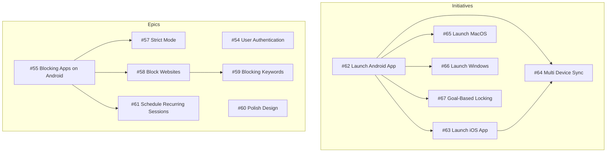
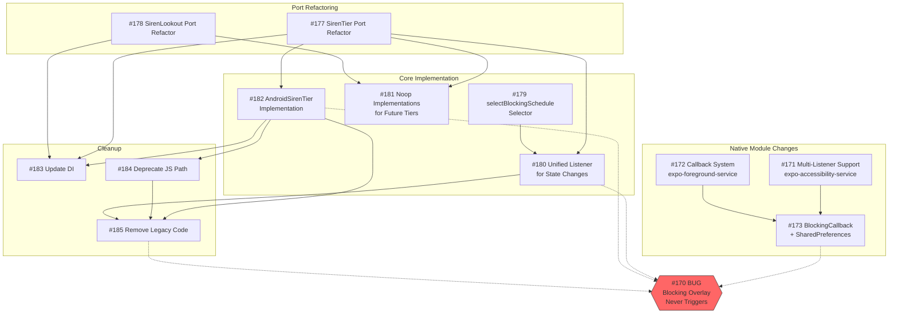
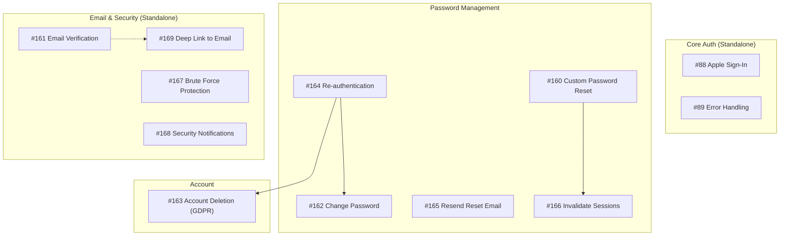

# Ticket Dependency Graph

This document visualizes the dependencies between GitHub issues to help with planning and prioritization.

## Complete Ticket Inventory

### Initiatives (6)
| # | Title | Depends On | Blocks |
|---|-------|------------|--------|
| #62 | Launch Android App | - | #63, #64, #65, #66, #67 |
| #63 | Launch iOS App | #62 | #64 |
| #64 | Multi Device Sync | #62, #63 | - |
| #65 | Launch MacOS | #62 | - |
| #66 | Launch Windows | #62 | - |
| #67 | Goal-Based Locking | #62 | - |

### Epics (7)
| # | Title | Depends On | Blocks |
|---|-------|------------|--------|
| #54 | User Authentication | - | - |
| #55 | Blocking Apps on Android | - | #57, #58, #59, #61 |
| #57 | Strict Mode | #55 | - |
| #58 | Block Websites on Android | #55 | #59 |
| #59 | Blocking Keywords on Android | #55, #58 | - |
| #60 | Polish Design | - | - |
| #61 | Schedule Recurring Sessions | #55 | - |

### Bug (1)
| # | Title | Severity | Related |
|---|-------|----------|---------|
| #170 | Blocking overlay never triggers | Critical | Fixed by #171-185 |

### Features - Blocking Architecture (15)
| # | Title | Depends On | Blocks |
|---|-------|------------|--------|
| #96 | Guided Permission Setup | - | - |
| #171 | Multi-Listener Support (accessibility) | - | #173 |
| #172 | Callback System (foreground service) | - | #173 |
| #173 | BlockingCallback + SharedPreferences | #171, #172 | - |
| #177 | SirenTier Port Refactor | - | #180, #181, #182, #183 |
| #178 | SirenLookout Port Refactor | - | #181, #183 |
| #179 | selectBlockingSchedule Selector | - | #180 |
| #180 | Unified Listener | #177, #179 | #185 |
| #181 | Noop Implementations | #177, #178 | - |
| #182 | AndroidSirenTier Implementation | #177 | #183, #184, #185 |
| #183 | Update Dependency Injection | #177, #178, #182 | - |
| #184 | Deprecate JS Detection Path | #182 | #185 |
| #185 | Remove Legacy Code | #180, #182, #184 | - |

### Features - Authentication (12)
| # | Title | Depends On | Blocks |
|---|-------|------------|--------|
| #88 | Apple Sign-In | - | - |
| #89 | Error Handling | - | - |
| #160 | Custom Password Reset | - | #166 |
| #161 | Email Verification | - | - |
| #162 | Change Password | - | - |
| #163 | Account Deletion (GDPR) | #164 | - |
| #164 | Re-authentication | - | #162, #163 |
| #165 | Resend Reset Email | - | - |
| #166 | Invalidate Sessions | #160 | - |
| #167 | Brute Force Protection | - | - |
| #168 | Security Notifications | - | - |
| #169 | Deep Link to Email | - | - |

---

## Overview Diagram



## Epic #55: Blocking Apps on Android - Fix Architecture

This epic addresses the critical bug #170 where blocking doesn't work when the app is backgrounded.



## Epic #54: User Authentication



## Recommended Execution Order

### Phase 1: Foundation (No Dependencies)
| Issue | Title | Points | Epic |
|-------|-------|--------|------|
| #177 | SirenTier Port Refactor | 3 | #55 |
| #178 | SirenLookout Port Refactor | 2 | #55 |
| #171 | Multi-Listener Support | 3 | #55 |
| #172 | Callback System | 3 | #55 |
| #179 | selectBlockingSchedule Selector | 5 | #55 |
| #88 | Apple Sign-In | 3 | #54 |
| #89 | Error Handling | 3 | #54 |
| #164 | Re-authentication | 2 | #54 |
| #160 | Custom Password Reset | 5 | #54 |
| #161 | Email Verification | 3 | #54 |

### Phase 2: Core Implementation
| Issue | Title | Depends On | Epic |
|-------|-------|------------|------|
| #173 | BlockingCallback + SharedPreferences | #171, #172 | #55 |
| #181 | Noop Implementations | #177, #178 | #55 |
| #182 | AndroidSirenTier Implementation | #177 | #55 |
| #180 | Unified Listener | #177, #179 | #55 |
| #162 | Change Password | #164 | #54 |
| #163 | Account Deletion | #164 | #54 |
| #166 | Invalidate Sessions | #160 | #54 |

### Phase 3: Integration & Cleanup
| Issue | Title | Depends On | Epic |
|-------|-------|------------|------|
| #183 | Update Dependency Injection | #177, #178, #182 | #55 |
| #184 | Deprecate JS Detection Path | #182 | #55 |
| #185 | Remove Legacy Code | #180, #182, #184 | #55 |

### Standalone Features (Can Start Anytime)
| Issue | Title | Points | Epic |
|-------|-------|--------|------|
| #96 | Guided Permission Setup | 3 | #55 |
| #165 | Resend Reset Email | 1 | #54 |
| #167 | Brute Force Protection | 2 | #54 |
| #168 | Security Notifications | 3 | #54 |
| #169 | Deep Link to Email | 2 | #54 |

## Critical Path

The critical path to fixing **#170** (Blocking overlay never triggers):

```
#177 (SirenTier Port) ─┬─> #182 (AndroidSirenTier) ─┬─> #184 (Deprecate JS) ─┐
                       │                            │                        │
#179 (Selector) ───────┴─> #180 (Unified Listener) ─┴────────────────────────┴─> #185 (Cleanup)
                                                                                      │
#171 (Multi-Listener) ─┬─> #173 (BlockingCallback) ──────────────────────────────────┘
                       │
#172 (Callback System) ┘
```

**Minimum viable fix:** Complete #171, #172, #173 for native-to-native blocking.
**Full architecture:** Complete all Phase 1-3 issues.

## Dependency Matrix

Quick reference showing what blocks what:

| Blocker | Blocks These Issues |
|---------|---------------------|
| #55 | #57, #58, #59, #61 |
| #58 | #59 |
| #62 | #63, #64, #65, #66, #67 |
| #63 | #64 |
| #160 | #166 |
| #164 | #162, #163 |
| #171 | #173 |
| #172 | #173 |
| #177 | #180, #181, #182, #183 |
| #178 | #181, #183 |
| #179 | #180 |
| #180 | #185 |
| #182 | #183, #184, #185 |
| #184 | #185 |

## Legend

- **Solid arrows (→)**: Direct dependency (must complete first)
- **Dotted arrows (-.->)**: Related/contributes to
- **Red nodes**: Bugs
- **Subgraphs**: Logical groupings

---

*Last updated: 2025-12-28*
*Generated from issue metadata*
