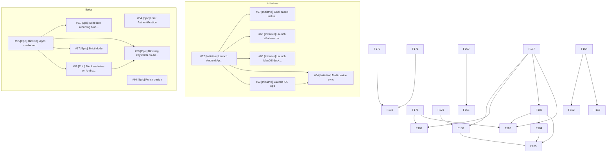
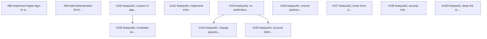
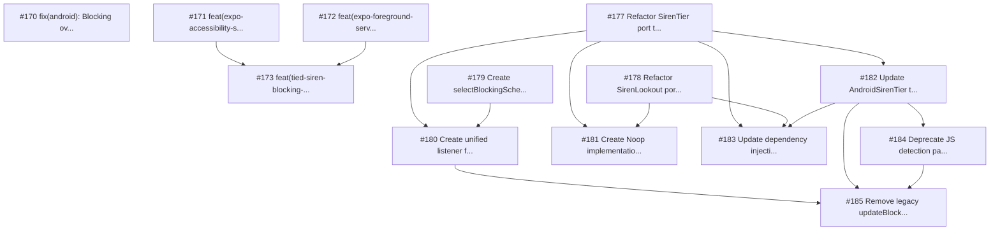

# Ticket Dependency Graph

This document visualizes the dependencies between GitHub issues to help with planning and prioritization.

> **Auto-generated** from GitHub issue metadata. Do not edit manually.
> Last updated: 2025-12-28

## Complete Ticket Inventory

### Initiatives (6)
| # | Title | Depends On | Blocks |
|---|-------|------------|--------|
| #62 | [Initiative] Launch Android App | - | #63, #64, #65, #66, #67 |
| #63 | [Initiative] Launch iOS App | #62 | #64 |
| #64 | [Initiative] Multi device sync | #62, #63 | - |
| #65 | [Initiative] Launch MacOS desktop App | #62 | - |
| #66 | [Initiative] Launch Windows desktop App | #62 | - |
| #67 | [Initiative] Goal based locking/unlocking | #62 | - |

### Epics (7)
| # | Title | Depends On | Blocks |
|---|-------|------------|--------|
| #54 | [Epic] User Authentification | - | - |
| #55 | [Epic] Blocking Apps on Android | - | #57, #58, #59, #61 |
| #57 | [Epic] Strict Mode | #55 | - |
| #58 | [Epic] Block websites on Android | #55 | #59 |
| #59 | [Epic] Blocking keywords on Android | #55, #58 | - |
| #60 | [Epic] Polish design | - | - |
| #61 | [Epic] Schedule recurring block sessions | #55 | - |

### Features - Authentication (12)
| # | Title | Depends On | Blocks |
|---|-------|------------|--------|
| #88 | Implement Apple Sign-In with Firebase | - | - |
| #89 | Add Authentication Error Handling | - | - |
| #160 | feat(auth): custom in-app password reset confirmation flow | - | #166 |
| #161 | feat(auth): implement email verification flow | - | - |
| #162 | feat(auth): change password when logged in | #164 | - |
| #163 | feat(auth): account deletion (GDPR compliance) | #164 | - |
| #164 | feat(auth): re-authentication for sensitive operations | - | #162, #163 |
| #165 | feat(auth): resend password reset email | - | - |
| #166 | feat(auth): invalidate sessions after password reset | #160 | - |
| #167 | feat(auth): brute force protection on login | - | - |
| #168 | feat(auth): security notification emails | - | - |
| #169 | feat(auth): deep link to email app after signup | - | - |

### Features - Other (1)
| # | Title | Depends On | Blocks |
|---|-------|------------|--------|
| #96 | Setup Phase - Guided Permission Setup - 3sp | - | - |

### Features - Blocking Architecture (13)
| # | Title | Depends On | Blocks |
|---|-------|------------|--------|
| #170 | fix(android): Blocking overlay never triggers - JS bridge architecture mismatch | - | - |
| #171 | feat(expo-accessibility-service): Add multiple listeners support | - | #173 |
| #172 | feat(expo-foreground-service): Add callback system via reflection | - | #173 |
| #173 | feat(tied-siren-blocking-overlay): Add BlockingCallback and SharedPreferences support | #171, #172 | - |
| #177 | Refactor SirenTier port to support sub-dependencies injection | - | #180, #181, #182, #183 |
| #178 | Refactor SirenLookout port to support sub-dependencies injection | - | #181, #183 |
| #179 | Create selectBlockingSchedule selector with fresh blocklist join | - | #180 |
| #180 | Create unified listener for blockSession and blocklist state changes | #177, #179 | #185 |
| #181 | Create Noop implementations for future tiers and lookouts | #177, #178 | - |
| #182 | Update AndroidSirenTier to call setBlockingSchedule | #177 | #183, #184, #185 |
| #183 | Update dependency injection with new architecture | #177, #178, #182 | - |
| #184 | Deprecate JS detection path (blockLaunchedApp usecase) | #182 | #185 |
| #185 | Remove legacy updateBlockedApps calls and related code | #180, #182, #184 | - |

---

## Overview Diagram

### Features: Authentication

### Features: Blocking Architecture

---

## Dependency Matrix

Quick reference showing what blocks what:

| Blocker | Blocks These Issues |
|---------|---------------------|
| #55 | #57, #58, #59, #61 |
| #58 | #59 |
| #62 | #63, #64, #65, #66, #67 |
| #63 | #64 |
| #160 | #166 |
| #164 | #162, #163 |
| #171 | #173 |
| #172 | #173 |
| #177 | #180, #181, #182, #183 |
| #178 | #181, #183 |
| #179 | #180 |
| #180 | #185 |
| #182 | #183, #184, #185 |
| #184 | #185 |

---

## Valid Repositories

| Repo | URL |
|------|-----|
| TiedSiren51 | https://github.com/amehmeto/TiedSiren51 |
| expo-accessibility-service | https://github.com/amehmeto/expo-accessibility-service |
| expo-foreground-service | https://github.com/amehmeto/expo-foreground-service |
| tied-siren-blocking-overlay | https://github.com/amehmeto/tied-siren-blocking-overlay |
| expo-list-installed-apps | https://github.com/amehmeto/expo-list-installed-apps |

---

## Legend

- **Solid arrows (`-->`)**: Direct dependency (must complete first)
- **Initiatives (I)**: Strategic goals
- **Epics (E)**: Large features with multiple stories
- **Features (F)**: Individual stories/tasks
- **Subgraphs**: Logical groupings

---

*Auto-generated on 2025-12-28 from GitHub issue metadata*
