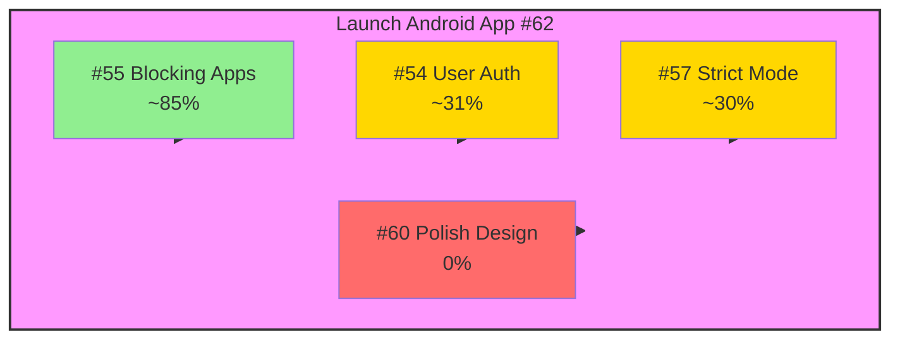
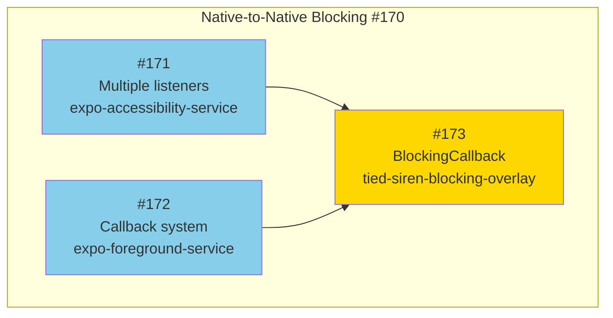
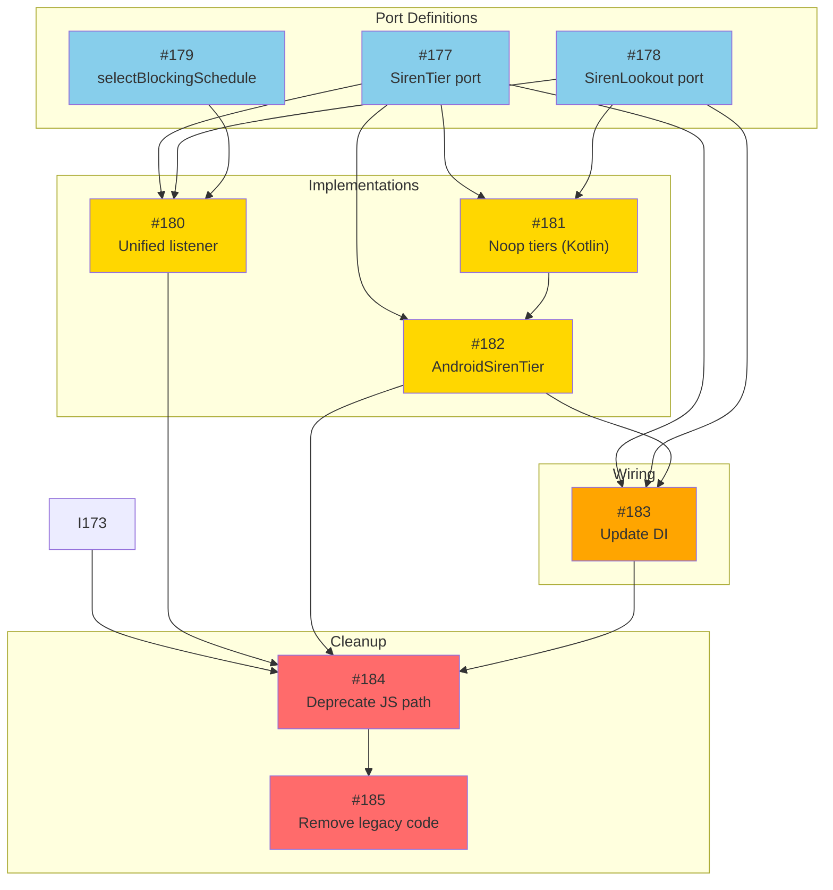
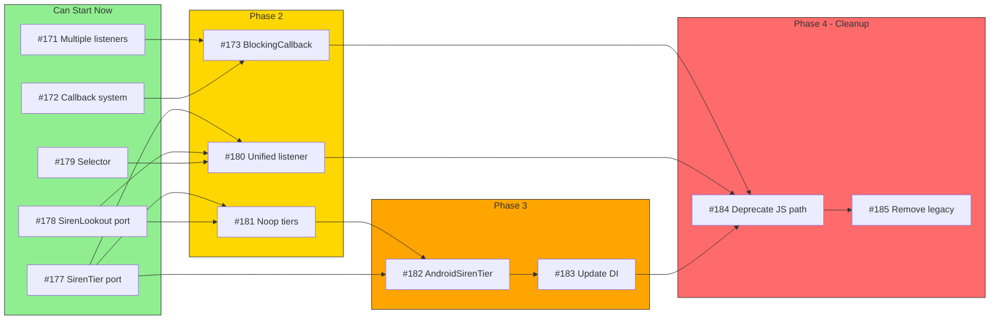
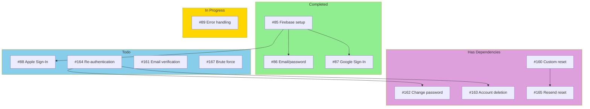

# Issue Dependency Graph

> Last updated: 2025-12-24
> Auto-generated by `/update-dependency-graph`

## Android v1.0 Critical Path



## Native Blocking Architecture

The critical fix for #170 (blocking overlay never triggers).



## JS Architecture Refactoring

Sequential dependency chain for clean architecture.



## Full Blocking Pipeline

Combined native + JS architecture.



## Authentication Track

Independent from blocking work.



## Work Streams Summary

| Stream | Can Start Now | Blocked By |
|--------|---------------|------------|
| **Native blocking** | #171, #172 | — |
| **JS ports** | #177, #178, #179 | — |
| **Native glue** | — | #171, #172 |
| **JS implementations** | — | Ports (#177, #178) |
| **Cleanup** | — | Everything else |
| **Auth** | #88, #89, #161, #164, #167 | — |

## Recommended Execution Order

### Week 1: Foundations (Parallel)
- [ ] #171 - Multiple listeners (native)
- [ ] #172 - Callback system (native)
- [ ] #177 - SirenTier port (JS)
- [ ] #178 - SirenLookout port (JS)
- [ ] #179 - selectBlockingSchedule (JS)

### Week 2: Implementations (Parallel after deps)
- [ ] #173 - BlockingCallback (needs #171, #172)
- [ ] #181 - Noop tiers in Kotlin (needs #177, #178)
- [ ] #180 - Unified listener (needs #177, #178, #179)

### Week 3: Wiring
- [ ] #182 - AndroidSirenTier (needs #177, #181)
- [ ] #183 - Update DI (needs #177, #178, #182)

### Week 4: Cleanup
- [ ] #184 - Deprecate JS path (needs #173, #180, #182, #183)
- [ ] #185 - Remove legacy code (needs #184)

---

## Legend

| Color | Meaning |
|-------|---------|
| Green | Ready to start / Completed |
| Blue | Can start (no blockers) |
| Yellow | In progress / Has some deps |
| Orange | Multiple dependencies |
| Red | Blocked / Final cleanup |
| Purple | Has dependencies |

---

## Raw Dependency Data

```yaml
# Native Blocking
171: []                          # Independent
172: []                          # Independent
173: [171, 172]                  # Needs both native modules

# JS Architecture
177: []                          # Independent
178: []                          # Independent
179: []                          # Independent
180: [177, 178, 179]             # Needs all ports
181: [177, 178]                  # Needs port definitions
182: [177, 181]                  # Needs tier port + noop impls
183: [177, 178, 182]             # Needs ports + AndroidSirenTier
184: [173, 180, 182, 183]        # Needs everything working
185: [184]                       # Must be last

# Auth (independent track)
88: [85]                         # Done
89: []                           # In progress
160: []                          # Independent
161: []                          # Independent
162: [164]                       # Needs re-auth
163: [164]                       # Needs re-auth
164: []                          # Independent
165: [160]                       # Needs custom reset first
166: []                          # Independent
167: []                          # Independent
168: []                          # Independent
169: []                          # Independent
```
