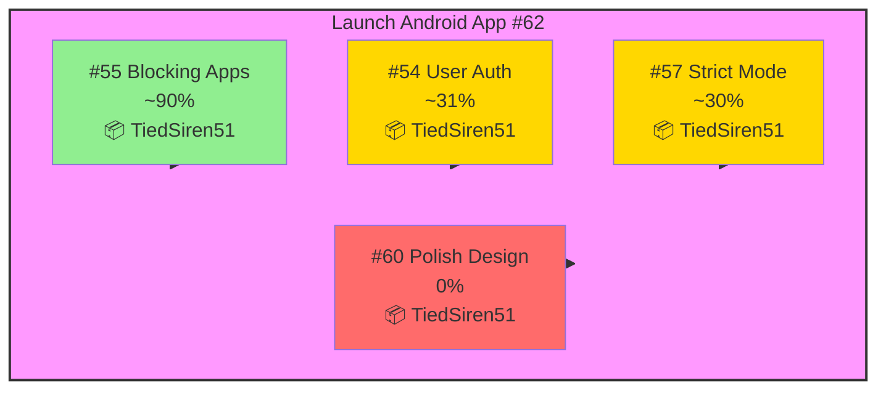
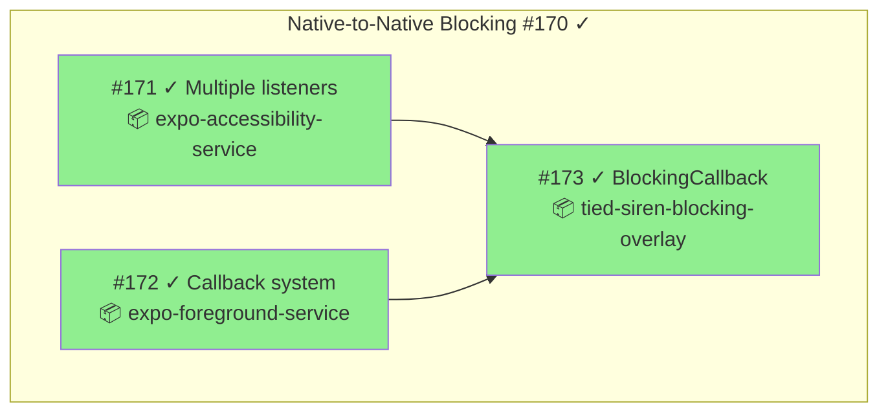
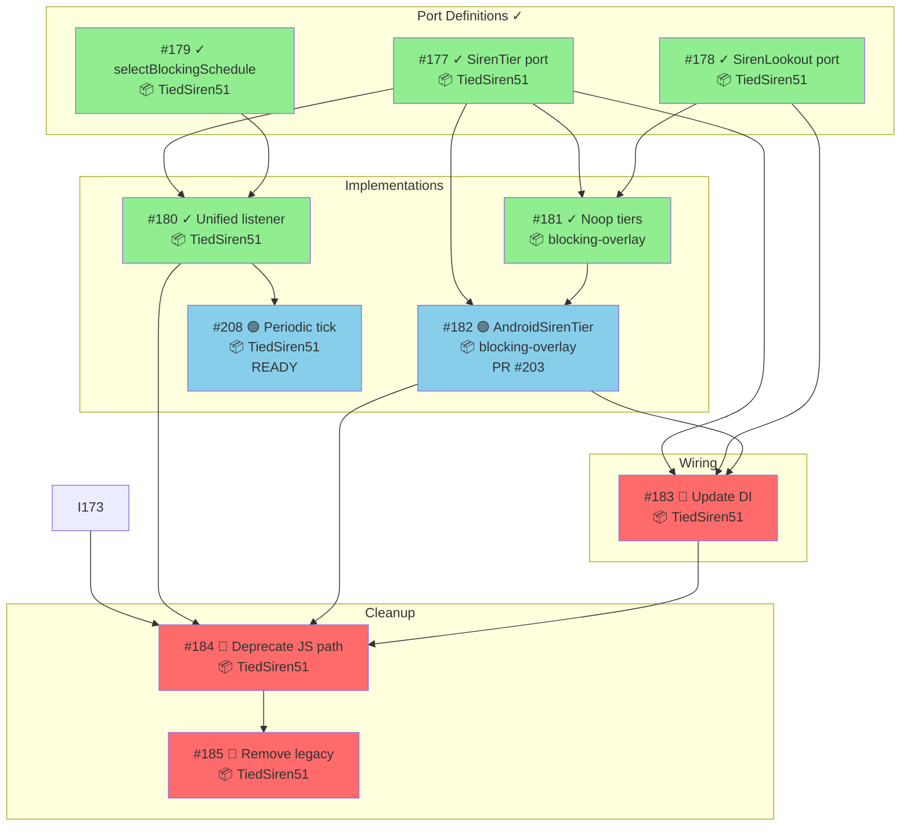
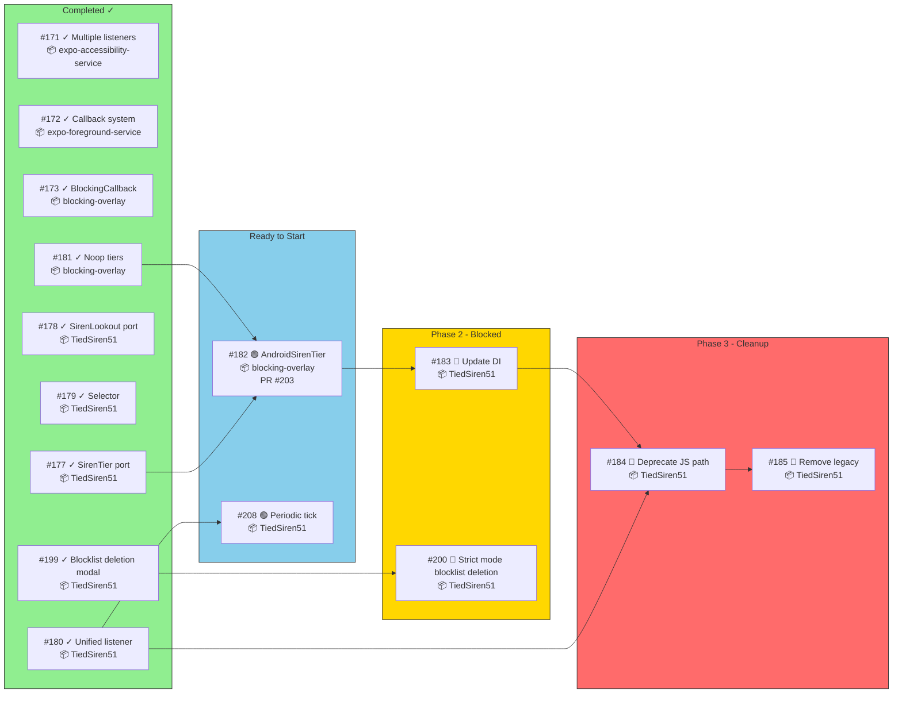
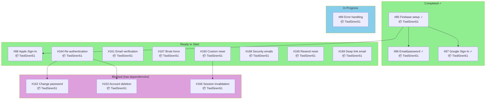
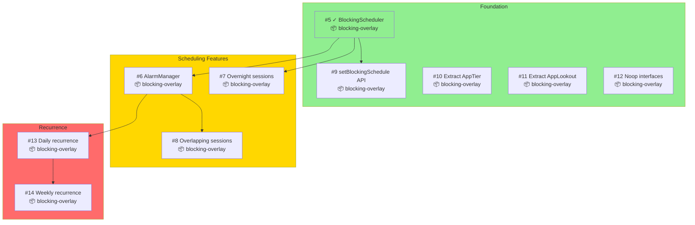
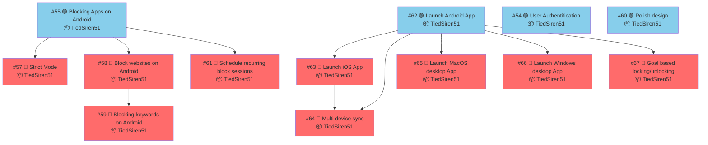

# Issue Dependency Graph

> Last updated: 2026-01-16
> Auto-generated by `/sync-project`
> Dependencies parsed from issue bodies (no hardcoding)

## Summary

| Metric | Value |
|--------|-------|
| Total Open Issues | 42 |
| Ready to Start | 22 |
| Blocked | 20 |
| Done (Recently) | 25 |

## Android v1.0 Critical Path



## Native Blocking Architecture

The critical fix for #170 (blocking overlay never triggers) - **ALL COMPLETE**



## JS Architecture Refactoring

Sequential dependency chain for clean architecture.



### Native Blocking Pipeline - Status Details

| # | Title | Status | Blocked By | SP |
|---|-------|--------|------------|-----|
| #177 | Refactor SirenTier port | ✓ done | — | 3 |
| #178 | Refactor SirenLookout port | ✓ done | — | 2 |
| #179 | Create selectBlockingSchedule selector | ✓ done | — | 5 |
| #180 | Create unified listener | ✓ done | — | 5 |
| #181 | Create Noop implementations | ✓ done | — | 2 |
| #182 | Update AndroidSirenTier to call setBlockingSchedule | 🟢 ready | — | 3 |
| #183 | Update dependency injection with new architecture | 🔴 blocked | #182 | 2 |
| #184 | Deprecate JS detection path | 🔴 blocked | #182 | 3 |
| #185 | Remove legacy updateBlockedApps calls | 🔴 blocked | #182, #184 | 2 |
| #208 | Re-evaluate blocking schedule on periodic tick | 🟢 ready | — | 3 |

## Full Blocking Pipeline

Combined native + JS architecture.



## Authentication Track

Independent from blocking work. All issues in **TiedSiren51**.



### Auth Status

| # | Title | Status | SP |
|---|-------|--------|-----|
| #88 | Implement Apple Sign-In with Firebase | 🟢 ready | 3 |
| #89 | Add Authentication Error Handling | 🔵 in-progress | 3 |
| #160 | Custom in-app password reset confirmation flow | 🟢 ready | 5 |
| #161 | Implement email verification flow | 🟢 ready | 3 |
| #162 | Change password when logged in | 🔴 blocked (#164) | 2 |
| #163 | Account deletion (GDPR compliance) | 🔴 blocked (#164) | 5 |
| #164 | Re-authentication for sensitive operations | 🟢 ready | 2 |
| #165 | Resend password reset email | 🟢 ready | 1 |
| #166 | Invalidate sessions after password reset | 🔴 blocked (#160) | 3 |
| #167 | Brute force protection on login | 🟢 ready | 2 |
| #168 | Security notification emails | 🟢 ready | 3 |
| #169 | Deep link to email app after signup | 🟢 ready | 2 |

## Blocking Overlay Native Scheduler

Issues in **tied-siren-blocking-overlay** repository.



## Initiatives & Epics Hierarchy



## Work Streams Summary

| Stream | Ready Now | In Progress | Blocked By | Done |
|--------|-----------|-------------|------------|------|
| **Native blocking** | — | — | — | #171 ✓, #172 ✓, #173 ✓ |
| **JS ports** | — | — | — | #177 ✓, #178 ✓, #179 ✓ |
| **JS implementations** | #182, #208 | — | — | #180 ✓, #181 ✓ |
| **Wiring** | — | — | #182 | — |
| **Cleanup** | — | — | Everything else | — |
| **Auth** | #88, #160-161, #164-165, #167-169 | #89 | — | #85-87 ✓ |
| **blocking-overlay** | #6, #9, #10, #11, #12 | — | — | #5 ✓ |
| **Strict mode** | #200 | — | #199 ✓ | #199 ✓ |

## Recommended Execution Order

### Phase 1: Foundations ✓ COMPLETE
- [x] #171 - Multiple listeners (expo-accessibility-service) ✓
- [x] #172 - Callback system (expo-foreground-service) ✓
- [x] #173 - BlockingCallback (blocking-overlay) ✓
- [x] #177 - SirenTier port (TiedSiren51) ✓
- [x] #178 - SirenLookout port (TiedSiren51) ✓
- [x] #181 - Noop tiers in Kotlin (blocking-overlay) ✓
- [x] #179 - selectBlockingSchedule (TiedSiren51) ✓
- [x] #180 - Unified listener (TiedSiren51) ✓
- [x] #199 - Blocklist deletion modal (TiedSiren51) ✓

### Phase 2: Current Focus
- [ ] #182 - AndroidSirenTier setBlockingSchedule (blocking-overlay) — **PR #203 OPEN**
  - Blocked by: [blocking-overlay#9](https://github.com/amehmeto/tied-siren-blocking-overlay/issues/9) - Expose setBlockingSchedule() API
- [ ] #208 - Periodic tick for schedule re-evaluation (TiedSiren51) — **READY TO START**

### Phase 3: After Phase 2
- [ ] #183 - Update DI (TiedSiren51) — needs #182
- [ ] #200 - Strict mode blocklist deletion (TiedSiren51) — needs #199 ✓

### Phase 4: Cleanup
- [ ] #184 - Deprecate JS path (TiedSiren51) — needs #173 ✓, #180 ✓, #182, #183
- [ ] #185 - Remove legacy code (TiedSiren51) — needs #184

---

## Repository Legend

| Abbreviation | Full Name | Type |
|--------------|-----------|------|
| TiedSiren51 | amehmeto/TiedSiren51 | Main app (React Native) |
| blocking-overlay | amehmeto/tied-siren-blocking-overlay | Native module (Kotlin) |
| expo-accessibility-service | amehmeto/expo-accessibility-service | Native module (Kotlin) |
| expo-foreground-service | amehmeto/expo-foreground-service | Native module (Kotlin) |

## Color Legend

| Color | Meaning |
|-------|---------|
| 🟢 Green | Done / Ready to start |
| 🔵 Blue | In progress |
| 🟡 Yellow | Has some deps remaining |
| 🟠 Orange | Multiple dependencies |
| 🔴 Red | Blocked / Final cleanup |
| 🟣 Purple | Has dependencies |

---

## Raw Dependency Data

```yaml
# Native Blocking - ALL DONE ✓
171: [] ✓ DONE                   # expo-accessibility-service
172: [] ✓ DONE                   # expo-foreground-service
173: [171, 172] ✓ DONE           # blocking-overlay

# JS Architecture (TiedSiren51 unless noted)
177: [] ✓ DONE                   # TiedSiren51
178: [] ✓ DONE                   # TiedSiren51
179: [] ✓ DONE                   # TiedSiren51
180: [177, 179] ✓ DONE           # TiedSiren51
181: [177, 178] ✓ DONE           # blocking-overlay
182: [177] → READY               # blocking-overlay (PR #203)
183: [177, 178, 182]             # TiedSiren51
184: [173, 180, 182, 183]        # TiedSiren51
185: [184]                       # TiedSiren51
208: [180] → READY               # TiedSiren51

# blocking-overlay native scheduler
5: [] ✓ DONE                     # blocking-overlay - Foundation
6: [5]                           # blocking-overlay - AlarmManager
7: [5]                           # blocking-overlay - Overnight
8: [5, 6]                        # blocking-overlay - Overlapping
9: [5]                           # blocking-overlay - JS API
10: []                           # blocking-overlay - AppTier abstraction
11: []                           # blocking-overlay - AppLookout abstraction
12: []                           # blocking-overlay - Noop interfaces
13: [5, 6]                       # blocking-overlay - Daily
14: [5, 6]                       # blocking-overlay - Weekly

# Auth (all TiedSiren51)
88: []                           # Ready
89: []                           # In progress
160: []                          # Ready
161: []                          # Ready
162: [164]                       # Needs re-auth
163: [164]                       # Needs re-auth
164: []                          # Ready
165: []                          # Ready
166: [160]                       # Needs custom reset
167: []                          # Ready
168: []                          # Ready
169: []                          # Ready

# Other
199: [] ✓ DONE                   # Blocklist deletion modal
200: [199] → READY               # Strict mode blocklist deletion
201: []                          # Refactor BlockSession
```

---

## Blocking Pipeline Progress

| Phase | Total | Done | Remaining |
|-------|-------|------|-----------|
| Phase 1 (Foundations) | 9 | 9 | 0 ✓ |
| Phase 2 (Current) | 2 | 0 | 2 |
| Phase 3 (Wiring) | 2 | 0 | 2 |
| Phase 4 (Cleanup) | 2 | 0 | 2 |
| **Total** | **15** | **9** | **6** |

**Progress: 60% complete**
