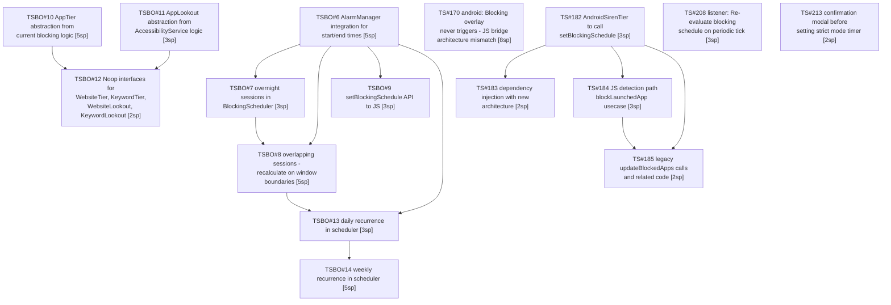
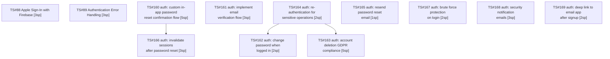

# Ticket Dependency Graph

This document visualizes the dependencies between GitHub issues to help with planning and prioritization.

> **Auto-generated** from GitHub issue metadata. Do not edit manually.
> Last updated: 2026-01-18

## Complete Ticket Inventory

### Initiatives (6)
| # | Title | SP | Depends On | Blocks |
|---|-------|----:|------------|--------|
| #62 | [Initiative] Launch Android App | - | - | #63, #64, #65, #66, #67 |
| #63 | [Initiative] Launch iOS App | - | #62 | #64 |
| #64 | [Initiative] Multi device sync | - | #62, #63 | - |
| #65 | [Initiative] Launch MacOS desktop App | - | #62 | - |
| #66 | [Initiative] Launch Windows desktop App | - | #62 | - |
| #67 | [Initiative] Goal based locking/unlocking | - | #62 | - |

### Epics (8)
| # | Title | SP | Depends On | Blocks |
|---|-------|----:|------------|--------|
| #54 | [Epic] User Authentification | 🔴 21 | - | - |
| #55 | [Epic] Blocking Apps on Android | 🔴 13 | - | #57, #58, #59, #61, #219 |
| #57 | [Epic] Strict Mode | 🔴 8 | #55 | - |
| #58 | [Epic] Block websites on Android | - | #55 | #59 |
| #59 | [Epic] Blocking keywords on Android | - | #55, #58 | - |
| #60 | [Epic] Polish design | - | - | - |
| #61 | [Epic] Schedule recurring block sessions | - | #55 | - |
| #219 | [Epic] Native Blocking Layer | 🔴 13 | #55 | - |

### Features - Other (3)
| # | Title | SP | Depends On | Blocks |
|---|-------|----:|------------|--------|
| #1 | Add ability to filter between system apps and user-installed apps on Android | - | - | - |
| #200 | feat(strict-mode): block blocklist deletion during active strict mode sessions | - | - | - |
| #201 | Refactor BlockSession to store blocklist IDs instead of embedded blocklists | 🟠 5 | - | - |

### Features - Blocking Architecture (16)
| # | Title | SP | Depends On | Blocks |
|---|-------|----:|------------|--------|
| #6 | Add AlarmManager integration for start/end times | 🟠 5 | #5 | #7, #8, #9, #13 |
| #7 | Handle overnight sessions in BlockingScheduler | 🟢 3 | #5, #6 | #8 |
| #8 | Handle overlapping sessions - recalculate on window boundaries | 🟠 5 | #5, #6, #7 | #13 |
| #9 | Expose setBlockingSchedule() API to JS | 🟢 3 | #5, #6 | - |
| #10 | Extract AppTier abstraction from current blocking logic | 🟠 5 | - | #12 |
| #11 | Extract AppLookout abstraction from AccessibilityService logic | 🟢 3 | - | #12 |
| #12 | Add Noop interfaces for WebsiteTier, KeywordTier, WebsiteLookout, KeywordLookout | 🟢 2 | #10, #11 | - |
| #13 | Handle daily recurrence in scheduler | 🟢 3 | #6, #8 | #14 |
| #14 | Handle weekly recurrence in scheduler | 🟠 5 | #13 | - |
| #170 | fix(android): Blocking overlay never triggers - JS bridge architecture mismatch | 🔴 8 | - | - |
| #182 | Update AndroidSirenTier to call setBlockingSchedule | 🟢 3 | #177 | #183, #184, #185 |
| #183 | Update dependency injection with new architecture | 🟢 2 | #177, #178, #182 | - |
| #184 | Deprecate JS detection path (blockLaunchedApp usecase) | 🟢 3 | #182 | #185 |
| #185 | Remove legacy updateBlockedApps calls and related code | 🟢 2 | #180, #182, #184 | - |
| #208 | feat(listener): Re-evaluate blocking schedule on periodic tick | 🟢 3 | #180 | - |
| #213 | Add confirmation modal before setting strict mode timer | 🟢 2 | - | - |

### Features - Authentication (12)
| # | Title | SP | Depends On | Blocks |
|---|-------|----:|------------|--------|
| #88 | Implement Apple Sign-In with Firebase | 🟢 3 | - | - |
| #89 | Add Authentication Error Handling | 🟢 3 | - | - |
| #160 | feat(auth): custom in-app password reset confirmation flow | 🟠 5 | - | #166 |
| #161 | feat(auth): implement email verification flow | 🟢 3 | - | - |
| #162 | feat(auth): change password when logged in | 🟢 2 | #164 | - |
| #163 | feat(auth): account deletion (GDPR compliance) | 🟠 5 | #164 | - |
| #164 | feat(auth): re-authentication for sensitive operations | 🟢 2 | - | #162, #163 |
| #165 | feat(auth): resend password reset email | 🔵 1 | - | - |
| #166 | feat(auth): invalidate sessions after password reset | 🟢 3 | #160 | - |
| #167 | feat(auth): brute force protection on login | 🟢 2 | - | - |
| #168 | feat(auth): security notification emails | 🟢 3 | - | - |
| #169 | feat(auth): deep link to email app after signup | 🟢 2 | - | - |

---

## Overview Diagram

```mermaid
flowchart LR
    classDef initiative0 fill:#7c3aed,stroke:#7c3aed,color:#fff
    classDef initiative1 fill:#8b5cf6,stroke:#7c3aed,color:#fff
    classDef initiative2 fill:#a78bfa,stroke:#8b5cf6,color:#000
    classDef initiative3 fill:#c4b5fd,stroke:#a78bfa,color:#000
    classDef initiative4 fill:#ddd6fe,stroke:#c4b5fd,color:#000
    classDef epic0 fill:#2563eb,stroke:#2563eb,color:#fff
    classDef epic1 fill:#3b82f6,stroke:#2563eb,color:#fff
    classDef epic2 fill:#60a5fa,stroke:#3b82f6,color:#000
    classDef epic3 fill:#93c5fd,stroke:#60a5fa,color:#000
    classDef epic4 fill:#bfdbfe,stroke:#93c5fd,color:#000
    classDef auth0 fill:#16a34a,stroke:#16a34a,color:#fff
    classDef auth1 fill:#22c55e,stroke:#16a34a,color:#fff
    classDef auth2 fill:#4ade80,stroke:#22c55e,color:#000
    classDef auth3 fill:#86efac,stroke:#4ade80,color:#000
    classDef auth4 fill:#bbf7d0,stroke:#86efac,color:#000
    classDef blocking0 fill:#ea580c,stroke:#ea580c,color:#fff
    classDef blocking1 fill:#f97316,stroke:#ea580c,color:#fff
    classDef blocking2 fill:#fb923c,stroke:#f97316,color:#000
    classDef blocking3 fill:#fdba74,stroke:#fb923c,color:#000
    classDef blocking4 fill:#fed7aa,stroke:#fdba74,color:#000
    classDef bug0 fill:#dc2626,stroke:#dc2626,color:#fff
    classDef bug1 fill:#ef4444,stroke:#dc2626,color:#fff
    classDef bug2 fill:#f87171,stroke:#ef4444,color:#000
    classDef bug3 fill:#fca5a5,stroke:#f87171,color:#000
    classDef bug4 fill:#fecaca,stroke:#fca5a5,color:#000
    classDef other0 fill:#4b5563,stroke:#4b5563,color:#fff
    classDef other1 fill:#6b7280,stroke:#4b5563,color:#fff
    classDef other2 fill:#9ca3af,stroke:#6b7280,color:#000
    classDef other3 fill:#d1d5db,stroke:#9ca3af,color:#000
    classDef other4 fill:#e5e7eb,stroke:#d1d5db,color:#000

    subgraph Initiatives
        direction TB
        T_TS_67["TS#67 Goal based locking/unlocking"]:::initiative1
        T_TS_66["TS#66 Launch Windows desktop App"]:::initiative1
        T_TS_65["TS#65 Launch MacOS desktop App"]:::initiative1
        T_TS_64["TS#64 Multi device sync"]:::initiative2
        T_TS_63["TS#63 Launch iOS App"]:::initiative1
        T_TS_62["TS#62 Launch Android App"]:::initiative0
    end
    subgraph Epic_219["TS#219 Native Blocking Layer"]
        direction TB
        T_TS_219["TS#219 Native Blocking Layer [13sp]"]:::epic1
        T_TSBO_12["TSBO#12 Noop interfaces for<br/>WebsiteTier, KeywordTier,<br/>WebsiteLookout, KeywordLookout [2sp]"]:::blocking1
        T_TSBO_11["TSBO#11 AppLookout abstraction from<br/>AccessibilityService logic [3sp]"]:::blocking0
        T_TSBO_10["TSBO#10 AppTier abstraction from<br/>current blocking logic [5sp]"]:::blocking0
        T_TSBO_9["TSBO#9 setBlockingSchedule API to JS [3sp]"]:::blocking1
        T_TSBO_8["TSBO#8 overlapping sessions -<br/>recalculate on window<br/>boundaries [5sp]"]:::blocking2
        T_TSBO_7["TSBO#7 overnight sessions in<br/>BlockingScheduler [3sp]"]:::blocking1
        T_TSBO_6["TSBO#6 AlarmManager integration for<br/>start/end times [5sp]"]:::blocking0
    end
    subgraph Epic_61["TS#61 Schedule recurring blo..."]
        direction TB
        T_TS_61["TS#61 Schedule recurring block<br/>sessions"]:::epic1
        T_TSBO_14["TSBO#14 weekly recurrence in scheduler [5sp]"]:::blocking4
        T_TSBO_13["TSBO#13 daily recurrence in scheduler [3sp]"]:::blocking3
    end
    subgraph Epic_60["TS#60 Polish design"]
        direction TB
        T_TS_60["TS#60 Polish design"]:::epic0
    end
    subgraph Epic_59["TS#59 Blocking keywords on A..."]
        direction TB
        T_TS_59["TS#59 Blocking keywords on Android"]:::epic2
    end
    subgraph Epic_58["TS#58 Block websites on Android"]
        direction TB
        T_TS_58["TS#58 Block websites on Android"]:::epic1
    end
    subgraph Epic_57["TS#57 Strict Mode"]
        direction TB
        T_TS_57["TS#57 Strict Mode [8sp]"]:::epic1
        T_TS_213["TS#213 confirmation modal before<br/>setting strict mode timer [2sp]"]:::blocking0
        T_TS_200["TS#200 strict-mode: block blocklist<br/>deletion during active strict<br/>mode sessions"]:::blocking0
    end
    subgraph Epic_55["TS#55 Blocking Apps on Android"]
        direction TB
        T_TS_55["TS#55 Blocking Apps on Android [13sp]"]:::epic0
        T_TS_208["TS#208 listener: Re-evaluate blocking<br/>schedule on periodic tick [3sp]"]:::blocking0
        T_TS_201["TS#201 BlockSession to store<br/>blocklist IDs instead of<br/>embedded blocklists [5sp]"]:::blocking0
        T_TS_185["TS#185 legacy updateBlockedApps calls<br/>and related code [2sp]"]:::blocking2
        T_TS_184["TS#184 JS detection path<br/>blockLaunchedApp usecase [3sp]"]:::blocking1
        T_TS_183["TS#183 dependency injection with new<br/>architecture [2sp]"]:::blocking1
        T_TS_182["TS#182 AndroidSirenTier to call<br/>setBlockingSchedule [3sp]"]:::blocking0
        T_TS_170["TS#170 android: Blocking overlay<br/>never triggers - JS bridge<br/>architecture mismatch [8sp]"]:::blocking0
    end
    subgraph Epic_54["TS#54 User Authentification"]
        direction TB
        T_TS_54["TS#54 User Authentification [21sp]"]:::epic0
        T_TS_169["TS#169 auth: deep link to email app<br/>after signup [2sp]"]:::auth0
        T_TS_168["TS#168 auth: security notification<br/>emails [3sp]"]:::auth0
        T_TS_167["TS#167 auth: brute force protection<br/>on login [2sp]"]:::auth0
        T_TS_166["TS#166 auth: invalidate sessions<br/>after password reset [3sp]"]:::auth1
        T_TS_165["TS#165 auth: resend password reset<br/>email [1sp]"]:::auth0
        T_TS_164["TS#164 auth: re-authentication for<br/>sensitive operations [2sp]"]:::auth0
        T_TS_163["TS#163 auth: account deletion GDPR<br/>compliance [5sp]"]:::auth1
        T_TS_162["TS#162 auth: change password when<br/>logged in [2sp]"]:::auth1
        T_TS_161["TS#161 auth: implement email<br/>verification flow [3sp]"]:::auth0
        T_TS_160["TS#160 auth: custom in-app password<br/>reset confirmation flow [5sp]"]:::auth0
        T_TS_89["TS#89 Authentication Error Handling [3sp]"]:::auth0
        T_TS_88["TS#88 Apple Sign-In with Firebase [3sp]"]:::auth0
    end
    subgraph Ungrouped
        direction TB
        T_ELIA_1["ELIA#1 ability to filter between<br/>system apps and user-installed<br/>apps and user-installed app..."]:::other0
    end

    T_TS_55 --> T_TS_219
    T_TS_182 --> T_TS_185
    T_TS_184 --> T_TS_185
    T_TS_182 --> T_TS_184
    T_TS_182 --> T_TS_183
    T_TS_160 --> T_TS_166
    T_TS_164 --> T_TS_163
    T_TS_164 --> T_TS_162
    T_TS_62 --> T_TS_67
    T_TS_62 --> T_TS_66
    T_TS_62 --> T_TS_65
    T_TS_62 --> T_TS_64
    T_TS_63 --> T_TS_64
    T_TS_62 --> T_TS_63
    T_TS_55 --> T_TS_61
    T_TS_55 --> T_TS_59
    T_TS_58 --> T_TS_59
    T_TS_55 --> T_TS_58
    T_TS_55 --> T_TS_57
    T_TSBO_13 --> T_TSBO_14
    T_TSBO_6 --> T_TSBO_13
    T_TSBO_8 --> T_TSBO_13
    T_TSBO_10 --> T_TSBO_12
    T_TSBO_11 --> T_TSBO_12
    T_TSBO_6 --> T_TSBO_9
    T_TSBO_6 --> T_TSBO_8
    T_TSBO_7 --> T_TSBO_8
    T_TSBO_6 --> T_TSBO_7
```

### Features: Blocking Architecture

### Features: Authentication

---

## Dependency Matrix

Quick reference showing what blocks what:

| Blocker | Blocks These Issues |
|---------|---------------------|
| TSBO#6 | #7, #8, #9, #13 |
| TSBO#7 | #8 |
| TSBO#8 | #13 |
| TSBO#10 | #12 |
| TSBO#11 | #12 |
| TSBO#13 | #14 |
| #55 | #57, #58, #59, #61, #219 |
| #58 | #59 |
| #62 | #63, #64, #65, #66, #67 |
| #63 | #64 |
| #160 | #166 |
| #164 | #162, #163 |
| #182 | #183, #184, #185 |
| #184 | #185 |

---

## Valid Repositories

| Repo | URL |
|------|-----|
| TiedSiren51 | https://github.com/amehmeto/TiedSiren51 |
| expo-accessibility-service | https://github.com/amehmeto/expo-accessibility-service |
| expo-foreground-service | https://github.com/amehmeto/expo-foreground-service |
| tied-siren-blocking-overlay | https://github.com/amehmeto/tied-siren-blocking-overlay |
| expo-list-installed-apps | https://github.com/amehmeto/expo-list-installed-apps |

---

## Legend

- **Solid arrows (`-->`)**: Direct dependency (must complete first)
- **Initiatives (I)**: Strategic goals
- **Epics (E)**: Large features with multiple stories
- **Features (F)**: Individual stories/tasks
- **Subgraphs**: Logical groupings

### Story Points

| Points | Color |
|-------:|-------|
| 1 | 🔵 Blue |
| 2-3 | 🟢 Green |
| 5 | 🟠 Orange |
| 8+ | 🔴 Red |

---

*Auto-generated on 2026-01-18 from GitHub issue metadata*
