# Issue Dependency Graph

> Last updated: 2026-01-16
> Auto-generated by `/sync-project`
> Dependencies parsed from issue bodies (no hardcoding)

## Summary

| Metric | Value |
|--------|-------|
| Total Open Issues | 42 |
| Ready to Start | 22 |
| Blocked | 20 |
| Done (Recently) | 25 |

## Android v1.0 Critical Path

```mermaid
flowchart TD
    subgraph INIT["Launch Android App #62"]
        direction TB
        E55["#55 Blocking Apps<br/>~90%<br/>📦 TiedSiren51"]
        E54["#54 User Auth<br/>~31%<br/>📦 TiedSiren51"]
        E57["#57 Strict Mode<br/>~30%<br/>📦 TiedSiren51"]
        E60["#60 Polish Design<br/>0%<br/>📦 TiedSiren51"]
    end

    E55 --> INIT
    E54 --> INIT
    E57 --> INIT
    E60 --> INIT

    style INIT fill:#f9f,stroke:#333,stroke-width:2px
    style E55 fill:#90EE90
    style E54 fill:#FFD700
    style E57 fill:#FFD700
    style E60 fill:#FF6B6B
```



## Native Blocking Architecture

The critical fix for #170 (blocking overlay never triggers) - **ALL COMPLETE**

```mermaid
flowchart TD
    subgraph NATIVE["Native-to-Native Blocking #170 ✓"]
        I171["#171 ✓ Multiple listeners<br/>📦 expo-accessibility-service"]
        I172["#172 ✓ Callback system<br/>📦 expo-foreground-service"]
        I173["#173 ✓ BlockingCallback<br/>📦 tied-siren-blocking-overlay"]
    end

    I171 --> I173
    I172 --> I173

    style I171 fill:#90EE90
    style I172 fill:#90EE90
    style I173 fill:#90EE90
```



## JS Architecture Refactoring

Sequential dependency chain for clean architecture.

```mermaid
flowchart TD
    subgraph PORTS["Port Definitions ✓"]
        I177["#177 ✓ SirenTier port<br/>📦 TiedSiren51"]
        I178["#178 ✓ SirenLookout port<br/>📦 TiedSiren51"]
        I179["#179 ✓ selectBlockingSchedule<br/>📦 TiedSiren51"]
    end

    subgraph IMPL["Implementations"]
        I181["#181 ✓ Noop tiers<br/>📦 blocking-overlay"]
        I182["#182 🟢 AndroidSirenTier<br/>📦 blocking-overlay<br/>PR #203"]
        I180["#180 ✓ Unified listener<br/>📦 TiedSiren51"]
        I208["#208 🟢 Periodic tick<br/>📦 TiedSiren51<br/>READY"]
    end

    subgraph WIRE["Wiring"]
        I183["#183 🔴 Update DI<br/>📦 TiedSiren51"]
    end

    subgraph CLEANUP["Cleanup"]
        I184["#184 🔴 Deprecate JS path<br/>📦 TiedSiren51"]
        I185["#185 🔴 Remove legacy<br/>📦 TiedSiren51"]
    end

    %% Port dependencies
    I177 --> I181
    I178 --> I181
    I177 --> I182
    I181 --> I182

    %% Listener needs ports + selector
    I177 --> I180
    I179 --> I180
    I180 --> I208

    %% DI needs implementations
    I177 --> I183
    I178 --> I183
    I182 --> I183

    %% Deprecation needs everything working
    I173 --> I184
    I180 --> I184
    I182 --> I184
    I183 --> I184

    %% Cleanup is last
    I184 --> I185

    style I177 fill:#90EE90
    style I178 fill:#90EE90
    style I179 fill:#90EE90
    style I181 fill:#90EE90
    style I180 fill:#90EE90
    style I182 fill:#87CEEB
    style I208 fill:#87CEEB
    style I183 fill:#FF6B6B
    style I184 fill:#FF6B6B
    style I185 fill:#FF6B6B
```



### Native Blocking Pipeline - Status Details

| # | Title | Status | Blocked By | SP |
|---|-------|--------|------------|-----|
| #177 | Refactor SirenTier port | ✓ done | — | 3 |
| #178 | Refactor SirenLookout port | ✓ done | — | 2 |
| #179 | Create selectBlockingSchedule selector | ✓ done | — | 5 |
| #180 | Create unified listener | ✓ done | — | 5 |
| #181 | Create Noop implementations | ✓ done | — | 2 |
| #182 | Update AndroidSirenTier to call setBlockingSchedule | 🟢 ready | — | 3 |
| #183 | Update dependency injection with new architecture | 🔴 blocked | #182 | 2 |
| #184 | Deprecate JS detection path | 🔴 blocked | #182 | 3 |
| #185 | Remove legacy updateBlockedApps calls | 🔴 blocked | #182, #184 | 2 |
| #208 | Re-evaluate blocking schedule on periodic tick | 🟢 ready | — | 3 |

## Full Blocking Pipeline

Combined native + JS architecture.

```mermaid
flowchart LR
    subgraph DONE["Completed ✓"]
        I171["#171 ✓ Multiple listeners<br/>📦 expo-accessibility-service"]
        I172["#172 ✓ Callback system<br/>📦 expo-foreground-service"]
        I173["#173 ✓ BlockingCallback<br/>📦 blocking-overlay"]
        I177["#177 ✓ SirenTier port<br/>📦 TiedSiren51"]
        I178["#178 ✓ SirenLookout port<br/>📦 TiedSiren51"]
        I179["#179 ✓ Selector<br/>📦 TiedSiren51"]
        I180["#180 ✓ Unified listener<br/>📦 TiedSiren51"]
        I181["#181 ✓ Noop tiers<br/>📦 blocking-overlay"]
        I199["#199 ✓ Blocklist deletion modal<br/>📦 TiedSiren51"]
    end

    subgraph READY["Ready to Start"]
        I182["#182 🟢 AndroidSirenTier<br/>📦 blocking-overlay<br/>PR #203"]
        I208["#208 🟢 Periodic tick<br/>📦 TiedSiren51"]
    end

    subgraph PHASE2["Phase 2 - Blocked"]
        I183["#183 🔴 Update DI<br/>📦 TiedSiren51"]
        I200["#200 🔴 Strict mode blocklist deletion<br/>📦 TiedSiren51"]
    end

    subgraph PHASE3["Phase 3 - Cleanup"]
        I184["#184 🔴 Deprecate JS path<br/>📦 TiedSiren51"]
        I185["#185 🔴 Remove legacy<br/>📦 TiedSiren51"]
    end

    I177 --> I182
    I181 --> I182
    I180 --> I208
    I182 --> I183
    I199 --> I200
    I180 --> I184
    I183 --> I184
    I184 --> I185

    style DONE fill:#90EE90,stroke:#333
    style READY fill:#87CEEB,stroke:#333
    style PHASE2 fill:#FFD700,stroke:#333
    style PHASE3 fill:#FF6B6B,stroke:#333
```



## Authentication Track

Independent from blocking work. All issues in **TiedSiren51**.


### Auth Status

| # | Title | Status | SP |
|---|-------|--------|-----|
| #88 | Implement Apple Sign-In with Firebase | 🟢 ready | 3 |
| #89 | Add Authentication Error Handling | 🔵 in-progress | 3 |
| #160 | Custom in-app password reset confirmation flow | 🟢 ready | 5 |
| #161 | Implement email verification flow | 🟢 ready | 3 |
| #162 | Change password when logged in | 🔴 blocked (#164) | 2 |
| #163 | Account deletion (GDPR compliance) | 🔴 blocked (#164) | 5 |
| #164 | Re-authentication for sensitive operations | 🟢 ready | 2 |
| #165 | Resend password reset email | 🟢 ready | 1 |
| #166 | Invalidate sessions after password reset | 🔴 blocked (#160) | 3 |
| #167 | Brute force protection on login | 🟢 ready | 2 |
| #168 | Security notification emails | 🟢 ready | 3 |
| #169 | Deep link to email app after signup | 🟢 ready | 2 |

## Blocking Overlay Native Scheduler

Issues in **tied-siren-blocking-overlay** repository.

```mermaid
flowchart TD
    subgraph FOUNDATION["Foundation"]
        B5["#5 ✓ BlockingScheduler<br/>📦 blocking-overlay"]
        B9["#9 setBlockingSchedule API<br/>📦 blocking-overlay"]
        B10["#10 Extract AppTier<br/>📦 blocking-overlay"]
        B11["#11 Extract AppLookout<br/>📦 blocking-overlay"]
        B12["#12 Noop interfaces<br/>📦 blocking-overlay"]
    end

    subgraph SCHEDULING["Scheduling Features"]
        B6["#6 AlarmManager<br/>📦 blocking-overlay"]
        B7["#7 Overnight sessions<br/>📦 blocking-overlay"]
        B8["#8 Overlapping sessions<br/>📦 blocking-overlay"]
    end

    subgraph RECURRENCE["Recurrence"]
        B13["#13 Daily recurrence<br/>📦 blocking-overlay"]
        B14["#14 Weekly recurrence<br/>📦 blocking-overlay"]
    end

    B5 --> B6
    B5 --> B7
    B5 --> B9
    B6 --> B8
    B6 --> B13
    B13 --> B14

    style B5 fill:#90EE90
    style FOUNDATION fill:#90EE90
    style SCHEDULING fill:#FFD700
    style RECURRENCE fill:#FF6B6B
```



## Initiatives & Epics Hierarchy

```mermaid
flowchart TD
    E62["#62 🟢 Launch Android App<br/>📦 TiedSiren51"]
    E55["#55 🟢 Blocking Apps on Android<br/>📦 TiedSiren51"]
    E54["#54 🟢 User Authentification<br/>📦 TiedSiren51"]
    E57["#57 🔴 Strict Mode<br/>📦 TiedSiren51"]
    E58["#58 🔴 Block websites on Android<br/>📦 TiedSiren51"]
    E59["#59 🔴 Blocking keywords on Android<br/>📦 TiedSiren51"]
    E60["#60 🟢 Polish design<br/>📦 TiedSiren51"]
    E61["#61 🔴 Schedule recurring block sessions<br/>📦 TiedSiren51"]
    E63["#63 🔴 Launch iOS App<br/>📦 TiedSiren51"]
    E64["#64 🔴 Multi device sync<br/>📦 TiedSiren51"]
    E65["#65 🔴 Launch MacOS desktop App<br/>📦 TiedSiren51"]
    E66["#66 🔴 Launch Windows desktop App<br/>📦 TiedSiren51"]
    E67["#67 🔴 Goal based locking/unlocking<br/>📦 TiedSiren51"]

    E55 --> E57
    E55 --> E58
    E55 --> E61
    E58 --> E59
    E62 --> E63
    E62 --> E64
    E62 --> E65
    E62 --> E66
    E62 --> E67
    E63 --> E64

    style E62 fill:#87CEEB
    style E55 fill:#87CEEB
    style E54 fill:#87CEEB
    style E60 fill:#87CEEB
    style E57 fill:#FF6B6B
    style E58 fill:#FF6B6B
    style E59 fill:#FF6B6B
    style E61 fill:#FF6B6B
    style E63 fill:#FF6B6B
    style E64 fill:#FF6B6B
    style E65 fill:#FF6B6B
    style E66 fill:#FF6B6B
    style E67 fill:#FF6B6B
```



## Work Streams Summary

| Stream | Ready Now | In Progress | Blocked By | Done |
|--------|-----------|-------------|------------|------|
| **Native blocking** | — | — | — | #171 ✓, #172 ✓, #173 ✓ |
| **JS ports** | — | — | — | #177 ✓, #178 ✓, #179 ✓ |
| **JS implementations** | #182, #208 | — | — | #180 ✓, #181 ✓ |
| **Wiring** | — | — | #182 | — |
| **Cleanup** | — | — | Everything else | — |
| **Auth** | #88, #160-161, #164-165, #167-169 | #89 | — | #85-87 ✓ |
| **blocking-overlay** | #6, #9, #10, #11, #12 | — | — | #5 ✓ |
| **Strict mode** | #200 | — | #199 ✓ | #199 ✓ |

## Recommended Execution Order

### Phase 1: Foundations ✓ COMPLETE
- [x] #171 - Multiple listeners (expo-accessibility-service) ✓
- [x] #172 - Callback system (expo-foreground-service) ✓
- [x] #173 - BlockingCallback (blocking-overlay) ✓
- [x] #177 - SirenTier port (TiedSiren51) ✓
- [x] #178 - SirenLookout port (TiedSiren51) ✓
- [x] #181 - Noop tiers in Kotlin (blocking-overlay) ✓
- [x] #179 - selectBlockingSchedule (TiedSiren51) ✓
- [x] #180 - Unified listener (TiedSiren51) ✓
- [x] #199 - Blocklist deletion modal (TiedSiren51) ✓

### Phase 2: Current Focus
- [ ] #182 - AndroidSirenTier setBlockingSchedule (blocking-overlay) — **PR #203 OPEN**
  - Blocked by: [blocking-overlay#9](https://github.com/amehmeto/tied-siren-blocking-overlay/issues/9) - Expose setBlockingSchedule() API
- [ ] #208 - Periodic tick for schedule re-evaluation (TiedSiren51) — **READY TO START**

### Phase 3: After Phase 2
- [ ] #183 - Update DI (TiedSiren51) — needs #182
- [ ] #200 - Strict mode blocklist deletion (TiedSiren51) — needs #199 ✓

### Phase 4: Cleanup
- [ ] #184 - Deprecate JS path (TiedSiren51) — needs #173 ✓, #180 ✓, #182, #183
- [ ] #185 - Remove legacy code (TiedSiren51) — needs #184

---

## Repository Legend

| Abbreviation | Full Name | Type |
|--------------|-----------|------|
| TiedSiren51 | amehmeto/TiedSiren51 | Main app (React Native) |
| blocking-overlay | amehmeto/tied-siren-blocking-overlay | Native module (Kotlin) |
| expo-accessibility-service | amehmeto/expo-accessibility-service | Native module (Kotlin) |
| expo-foreground-service | amehmeto/expo-foreground-service | Native module (Kotlin) |

## Color Legend

| Color | Meaning |
|-------|---------|
| 🟢 Green | Done / Ready to start |
| 🔵 Blue | In progress |
| 🟡 Yellow | Has some deps remaining |
| 🟠 Orange | Multiple dependencies |
| 🔴 Red | Blocked / Final cleanup |
| 🟣 Purple | Has dependencies |

---

## Raw Dependency Data

```yaml
# Native Blocking - ALL DONE ✓
171: [] ✓ DONE                   # expo-accessibility-service
172: [] ✓ DONE                   # expo-foreground-service
173: [171, 172] ✓ DONE           # blocking-overlay

# JS Architecture (TiedSiren51 unless noted)
177: [] ✓ DONE                   # TiedSiren51
178: [] ✓ DONE                   # TiedSiren51
179: [] ✓ DONE                   # TiedSiren51
180: [177, 179] ✓ DONE           # TiedSiren51
181: [177, 178] ✓ DONE           # blocking-overlay
182: [177] → READY               # blocking-overlay (PR #203)
183: [177, 178, 182]             # TiedSiren51
184: [173, 180, 182, 183]        # TiedSiren51
185: [184]                       # TiedSiren51
208: [180] → READY               # TiedSiren51

# blocking-overlay native scheduler
5: [] ✓ DONE                     # blocking-overlay - Foundation
6: [5]                           # blocking-overlay - AlarmManager
7: [5]                           # blocking-overlay - Overnight
8: [5, 6]                        # blocking-overlay - Overlapping
9: [5]                           # blocking-overlay - JS API
10: []                           # blocking-overlay - AppTier abstraction
11: []                           # blocking-overlay - AppLookout abstraction
12: []                           # blocking-overlay - Noop interfaces
13: [5, 6]                       # blocking-overlay - Daily
14: [5, 6]                       # blocking-overlay - Weekly

# Auth (all TiedSiren51)
88: []                           # Ready
89: []                           # In progress
160: []                          # Ready
161: []                          # Ready
162: [164]                       # Needs re-auth
163: [164]                       # Needs re-auth
164: []                          # Ready
165: []                          # Ready
166: [160]                       # Needs custom reset
167: []                          # Ready
168: []                          # Ready
169: []                          # Ready

# Other
199: [] ✓ DONE                   # Blocklist deletion modal
200: [199] → READY               # Strict mode blocklist deletion
201: []                          # Refactor BlockSession
```

---

## Blocking Pipeline Progress

| Phase | Total | Done | Remaining |
|-------|-------|------|-----------|
| Phase 1 (Foundations) | 9 | 9 | 0 ✓ |
| Phase 2 (Current) | 2 | 0 | 2 |
| Phase 3 (Wiring) | 2 | 0 | 2 |
| Phase 4 (Cleanup) | 2 | 0 | 2 |
| **Total** | **15** | **9** | **6** |

**Progress: 60% complete**
