# Ticket Dependency Graph

This document visualizes the dependencies between GitHub issues to help with planning and prioritization.

> **Auto-generated** from GitHub issue metadata. Do not edit manually.
> Last updated: 2026-01-18

## Validation Warnings

The following bidirectional reference issues were detected:

- #180 should have blocks: [208] (because #208 depends on it)
- TSBO#5 should have blocks: [9] (because TSBO#9 depends on it)
- TSBO#5 should have blocks: [8] (because TSBO#8 depends on it)
- TSBO#5 should have blocks: [7] (because TSBO#7 depends on it)
- TSBO#5 should have blocks: [6] (because TSBO#6 depends on it)

---

## Complete Ticket Inventory

### Initiatives (6)
| # | Title | SP | Depends On | Blocks |
|---|-------|----:|------------|--------|
| #62 | [Initiative] Launch Android App | - | - | #63, #64, #65, #66, #67 |
| #63 | [Initiative] Launch iOS App | - | #62 | #64 |
| #64 | [Initiative] Multi device sync | - | #62, #63 | - |
| #65 | [Initiative] Launch MacOS desktop App | - | #62 | - |
| #66 | [Initiative] Launch Windows desktop App | - | #62 | - |
| #67 | [Initiative] Goal based locking/unlocking | - | #62 | - |

### Epics (8)
| # | Title | SP | Depends On | Blocks |
|---|-------|----:|------------|--------|
| #54 | [Epic] User Authentification | 🔴 21 | - | - |
| #55 | [Epic] Blocking Apps on Android | 🔴 13 | - | #57, #58, #59, #61, #219 |
| #57 | [Epic] Strict Mode | 🔴 8 | #55 | - |
| #58 | [Epic] Block websites on Android | - | #55 | #59 |
| #59 | [Epic] Blocking keywords on Android | - | #55, #58 | - |
| #60 | [Epic] Polish design | - | - | - |
| #61 | [Epic] Schedule recurring block sessions | - | #55 | - |
| #219 | [Epic] Native Blocking Layer | 🔴 13 | #55 | - |

### Bugs (1)
| # | Title | SP | Severity | Related |
|---|-------|----:|----------|---------| 
| #80 | [Bug] Logout redirects to /login modal instead of /home, requires double close | - | medium | - |

### Features - Other (14)
| # | Title | SP | Depends On | Blocks |
|---|-------|----:|------------|--------|
| #1 | Add ability to filter between system apps and user-installed apps on Android | - | - | - |
| #4 | Thanks for this module and request for tutorial or guide | - | - | - |
| #56 | Misc Maintenance | - | - | - |
| #81 | [Refactor] 🐛 Unnecessary Store State Management in `useAppInitialization` Hook | - | - | - |
| #87 | Implement Google Sign-In with Firebase | - | - | - |
| #93 | Implementing env vars | - | - | - |
| #95 | Create expo-accessibility-service Module with isEnabled() and askPermission() - 3 sp | - | - | - |
| #96 | Setup Phase - Guided Permission Setup - 3sp | 🟢 3 | - | - |
| #97 | App Launch Monitoring via AccessibilityService - 2 sp | - | - | - |
| #103 | Handle Accessibility Permission on App Start - 3 sp | - | - | - |
| #199 | feat(blocklist): add confirmation modal when deleting blocklist used in active sessions | - | - | - |
| #200 | feat(strict-mode): block blocklist deletion during active strict mode sessions | - | - | - |
| #201 | Refactor BlockSession to store blocklist IDs instead of embedded blocklists | 🟠 5 | - | - |
| #202 | test | - | - | - |

### Features - Blocking Architecture (28)
| # | Title | SP | Depends On | Blocks |
|---|-------|----:|------------|--------|
| #5 | Implement BlockingScheduler with schedule storage | - | - | - |
| #6 | Add AlarmManager integration for start/end times | 🟠 5 | #5 | #7, #8, #9, #13 |
| #7 | Handle overnight sessions in BlockingScheduler | 🟢 3 | #5, #6 | #8 |
| #8 | Handle overlapping sessions - recalculate on window boundaries | 🟠 5 | #5, #6, #7 | #13 |
| #9 | Expose setBlockingSchedule() API to JS | 🟢 3 | #5, #6 | - |
| #10 | Extract AppTier abstraction from current blocking logic | 🟠 5 | - | #12 |
| #11 | Extract AppLookout abstraction from AccessibilityService logic | 🟢 3 | - | #12 |
| #12 | Add Noop interfaces for WebsiteTier, KeywordTier, WebsiteLookout, KeywordLookout | 🟢 2 | #10, #11 | - |
| #13 | Handle daily recurrence in scheduler | 🟢 3 | #6, #8 | #14 |
| #14 | Handle weekly recurrence in scheduler | 🟠 5 | #13 | - |
| #101 | Blocking Decision Logic - 2 sp | - | - | - |
| #102 | Standalone Expo Module: Android Blocking Overlay Launcher - 1 sp | - | - | - |
| #170 | fix(android): Blocking overlay never triggers - JS bridge architecture mismatch | 🔴 8 | - | - |
| #171 | feat(expo-accessibility-service): Add multiple listeners support | 🟢 3 | - | #173 |
| #172 | feat(expo-foreground-service): Add callback system via reflection | 🟢 3 | - | #173 |
| #173 | feat(tied-siren-blocking-overlay): Add BlockingCallback and SharedPreferences support | 🟠 5 | #171, #172 | - |
| #174 | feat(js): Add native blocking initialization and sync logic | - | - | - |
| #177 | Refactor SirenTier port to support sub-dependencies injection | 🟢 3 | - | #180, #181, #182, #183 |
| #178 | Refactor SirenLookout port to support sub-dependencies injection | 🟢 2 | - | #181, #183 |
| #179 | Create selectBlockingSchedule selector with fresh blocklist join | 🟠 5 | - | #180 |
| #180 | Create unified listener for blockSession and blocklist state changes | 🟠 5 | #177, #179 | #185 |
| #181 | Create Noop implementations for future tiers and lookouts | 🟢 2 | #177, #178 | - |
| #182 | Update AndroidSirenTier to call setBlockingSchedule | 🟢 3 | #177 | #183, #184, #185 |
| #183 | Update dependency injection with new architecture | 🟢 2 | #177, #178, #182 | - |
| #184 | Deprecate JS detection path (blockLaunchedApp usecase) | 🟢 3 | #182 | #185 |
| #185 | Remove legacy updateBlockedApps calls and related code | 🟢 2 | #180, #182, #184 | - |
| #208 | feat(listener): Re-evaluate blocking schedule on periodic tick | 🟢 3 | #180 | - |
| #213 | Add confirmation modal before setting strict mode timer | 🟢 2 | - | - |

### Features - Authentication (14)
| # | Title | SP | Depends On | Blocks |
|---|-------|----:|------------|--------|
| #85 | Setup Firebase Authentication Infrastructure | - | - | - |
| #86 | Implement Email/Password Authentication with Firebase | - | - | - |
| #88 | Implement Apple Sign-In with Firebase | 🟢 3 | - | - |
| #89 | Add Authentication Error Handling | 🟢 3 | - | - |
| #160 | feat(auth): custom in-app password reset confirmation flow | 🟠 5 | - | #166 |
| #161 | feat(auth): implement email verification flow | 🟢 3 | - | - |
| #162 | feat(auth): change password when logged in | 🟢 2 | #164 | - |
| #163 | feat(auth): account deletion (GDPR compliance) | 🟠 5 | #164 | - |
| #164 | feat(auth): re-authentication for sensitive operations | 🟢 2 | - | #162, #163 |
| #165 | feat(auth): resend password reset email | 🔵 1 | - | - |
| #166 | feat(auth): invalidate sessions after password reset | 🟢 3 | #160 | - |
| #167 | feat(auth): brute force protection on login | 🟢 2 | - | - |
| #168 | feat(auth): security notification emails | 🟢 3 | - | - |
| #169 | feat(auth): deep link to email app after signup | 🟢 2 | - | - |

---

## Overview Diagram

```mermaid
flowchart LR
    classDef initiative0_todo fill:#7c3aed,stroke:#7c3aed,color:#fff
    classDef initiative0_in_progress fill:#a97af9,stroke:#000,color:#fff,stroke-width:3px
    classDef initiative0_done fill:#626262,stroke:#626262,color:#666,stroke-dasharray:3
    classDef initiative1_todo fill:#8b5cf6,stroke:#7c3aed,color:#fff
    classDef initiative1_in_progress fill:#bda0fe,stroke:#000,color:#fff,stroke-width:3px
    classDef initiative1_done fill:#7c7c7c,stroke:#626262,color:#666,stroke-dasharray:3
    classDef initiative2_todo fill:#a78bfa,stroke:#8b5cf6,color:#000
    classDef initiative2_in_progress fill:#c6b3ff,stroke:#000,color:#000,stroke-width:3px
    classDef initiative2_done fill:#a0a0a0,stroke:#7c7c7c,color:#666,stroke-dasharray:3
    classDef initiative3_todo fill:#c4b5fd,stroke:#a78bfa,color:#000
    classDef initiative3_in_progress fill:#c2b3ff,stroke:#000,color:#000,stroke-width:3px
    classDef initiative3_done fill:#c2c2c2,stroke:#a0a0a0,color:#666,stroke-dasharray:3
    classDef epic0_todo fill:#2563eb,stroke:#2563eb,color:#fff
    classDef epic0_in_progress fill:#6493f8,stroke:#000,color:#fff,stroke-width:3px
    classDef epic0_done fill:#606060,stroke:#606060,color:#666,stroke-dasharray:3
    classDef epic1_todo fill:#3b82f6,stroke:#2563eb,color:#fff
    classDef epic1_in_progress fill:#7fafff,stroke:#000,color:#fff,stroke-width:3px
    classDef epic1_done fill:#7a7a7a,stroke:#606060,color:#666,stroke-dasharray:3
    classDef epic2_todo fill:#60a5fa,stroke:#3b82f6,color:#000
    classDef epic2_in_progress fill:#a8cfff,stroke:#000,color:#000,stroke-width:3px
    classDef epic2_done fill:#9a9a9a,stroke:#7a7a7a,color:#666,stroke-dasharray:3
    classDef epic3_todo fill:#93c5fd,stroke:#60a5fa,color:#000
    classDef epic3_in_progress fill:#b3d7ff,stroke:#000,color:#000,stroke-width:3px
    classDef epic3_done fill:#bcbcbc,stroke:#9a9a9a,color:#666,stroke-dasharray:3
    classDef auth0_todo fill:#16a34a,stroke:#16a34a,color:#fff
    classDef auth0_in_progress fill:#1beb67,stroke:#000,color:#fff,stroke-width:3px
    classDef auth0_done fill:#6f6f6f,stroke:#6f6f6f,color:#666,stroke-dasharray:3
    classDef auth1_todo fill:#22c55e,stroke:#16a34a,color:#fff
    classDef auth1_in_progress fill:#4be885,stroke:#000,color:#fff,stroke-width:3px
    classDef auth1_done fill:#898989,stroke:#6f6f6f,color:#666,stroke-dasharray:3
    classDef auth2_todo fill:#4ade80,stroke:#22c55e,color:#000
    classDef auth2_in_progress fill:#86efac,stroke:#000,color:#000,stroke-width:3px
    classDef auth2_done fill:#a7a7a7,stroke:#898989,color:#666,stroke-dasharray:3
    classDef auth3_todo fill:#86efac,stroke:#4ade80,color:#000
    classDef auth3_in_progress fill:#b9f9d0,stroke:#000,color:#000,stroke-width:3px
    classDef auth3_done fill:#c8c8c8,stroke:#a7a7a7,color:#666,stroke-dasharray:3
    classDef blocking0_todo fill:#ea580c,stroke:#ea580c,color:#fff
    classDef blocking0_in_progress fill:#fe8444,stroke:#000,color:#fff,stroke-width:3px
    classDef blocking0_done fill:#7b7b7b,stroke:#7b7b7b,color:#666,stroke-dasharray:3
    classDef blocking1_todo fill:#f97316,stroke:#ea580c,color:#fff
    classDef blocking1_in_progress fill:#ff9f5d,stroke:#000,color:#fff,stroke-width:3px
    classDef blocking1_done fill:#909090,stroke:#7b7b7b,color:#666,stroke-dasharray:3
    classDef blocking2_todo fill:#fb923c,stroke:#f97316,color:#000
    classDef blocking2_in_progress fill:#ffbc84,stroke:#000,color:#000,stroke-width:3px
    classDef blocking2_done fill:#a8a8a8,stroke:#909090,color:#666,stroke-dasharray:3
    classDef blocking3_todo fill:#fdba74,stroke:#fb923c,color:#000
    classDef blocking3_in_progress fill:#ffdab3,stroke:#000,color:#000,stroke-width:3px
    classDef blocking3_done fill:#c6c6c6,stroke:#a8a8a8,color:#666,stroke-dasharray:3
    classDef bug0_todo fill:#dc2626,stroke:#dc2626,color:#fff
    classDef bug0_in_progress fill:#ed6262,stroke:#000,color:#fff,stroke-width:3px
    classDef bug0_done fill:#5c5c5c,stroke:#5c5c5c,color:#666,stroke-dasharray:3
    classDef bug1_todo fill:#ef4444,stroke:#dc2626,color:#fff
    classDef bug1_in_progress fill:#fa8585,stroke:#000,color:#fff,stroke-width:3px
    classDef bug1_done fill:#777777,stroke:#5c5c5c,color:#666,stroke-dasharray:3
    classDef bug2_todo fill:#f87171,stroke:#ef4444,color:#000
    classDef bug2_in_progress fill:#ffb3b3,stroke:#000,color:#000,stroke-width:3px
    classDef bug2_done fill:#999999,stroke:#777777,color:#666,stroke-dasharray:3
    classDef bug3_todo fill:#fca5a5,stroke:#f87171,color:#000
    classDef bug3_in_progress fill:#ffb3b3,stroke:#000,color:#000,stroke-width:3px
    classDef bug3_done fill:#bfbfbf,stroke:#999999,color:#666,stroke-dasharray:3
    classDef other0_todo fill:#4b5563,stroke:#4b5563,color:#fff
    classDef other0_in_progress fill:#6a7a90,stroke:#000,color:#fff,stroke-width:3px
    classDef other0_done fill:#545454,stroke:#545454,color:#666,stroke-dasharray:3
    classDef other1_todo fill:#6b7280,stroke:#4b5563,color:#fff
    classDef other1_in_progress fill:#9298a6,stroke:#000,color:#fff,stroke-width:3px
    classDef other1_done fill:#727272,stroke:#545454,color:#666,stroke-dasharray:3
    classDef other2_todo fill:#9ca3af,stroke:#6b7280,color:#000
    classDef other2_in_progress fill:#c6cad2,stroke:#000,color:#000,stroke-width:3px
    classDef other2_done fill:#a2a2a2,stroke:#727272,color:#666,stroke-dasharray:3
    classDef other3_todo fill:#d1d5db,stroke:#9ca3af,color:#000
    classDef other3_in_progress fill:#d4d8de,stroke:#000,color:#000,stroke-width:3px
    classDef other3_done fill:#d4d4d4,stroke:#a2a2a2,color:#666,stroke-dasharray:3

    subgraph Initiatives
        direction TB
        T_TS_67["⏳ TS#67 Goal based locking/unlocking"]:::initiative1_todo
        T_TS_66["⏳ TS#66 Launch Windows desktop App"]:::initiative1_todo
        T_TS_65["⏳ TS#65 Launch MacOS desktop App"]:::initiative1_todo
        T_TS_64["⏳ TS#64 Multi device sync"]:::initiative2_todo
        T_TS_63["⏳ TS#63 Launch iOS App"]:::initiative1_todo
        T_TS_62["⏳ TS#62 Launch Android App"]:::initiative0_todo
    end
    subgraph Epics
        direction TB
        T_TS_219["⏳ TS#219 Native Blocking Layer [13sp]"]:::epic1_todo
        T_TS_61["⏳ TS#61 Schedule recurring block<br/>sessions"]:::epic1_todo
        T_TS_60["⏳ TS#60 Polish design"]:::epic0_todo
        T_TS_59["⏳ TS#59 Blocking keywords on Android"]:::epic2_todo
        T_TS_58["⏳ TS#58 Block websites on Android"]:::epic1_todo
        T_TS_57["⏳ TS#57 Strict Mode [8sp]"]:::epic1_todo
        T_TS_55["⏳ TS#55 Blocking Apps on Android [13sp]"]:::epic0_todo
        T_TS_54["⏳ TS#54 User Authentification [21sp]"]:::epic0_todo
    end
    subgraph Epic_219["TS#219 Native Blocking Layer"]
        direction TB
        T_TSBO_12["⏳ TSBO#12 Noop interfaces for<br/>WebsiteTier, KeywordTier,<br/>WebsiteLookout, KeywordLookout [2sp]"]:::blocking1_todo
        T_TSBO_11["⏳ TSBO#11 AppLookout abstraction from<br/>AccessibilityService logic [3sp]"]:::blocking0_todo
        T_TSBO_10["⏳ TSBO#10 AppTier abstraction from<br/>current blocking logic [5sp]"]:::blocking0_todo
        T_TSBO_9["⏳ TSBO#9 setBlockingSchedule API to JS [3sp]"]:::blocking0_todo
        T_TSBO_8["⏳ TSBO#8 overlapping sessions -<br/>recalculate on window<br/>boundaries [5sp]"]:::blocking0_todo
        T_TSBO_7["⏳ TSBO#7 overnight sessions in<br/>BlockingScheduler [3sp]"]:::blocking0_todo
        T_TSBO_6["🔄 TSBO#6 AlarmManager integration for<br/>start/end times [5sp]"]:::blocking0_in_progress
    end
    subgraph Epic_61["TS#61 Schedule recurring blo..."]
        direction TB
        T_TSBO_14["⏳ TSBO#14 weekly recurrence in scheduler [5sp]"]:::blocking0_todo
        T_TSBO_13["⏳ TSBO#13 daily recurrence in scheduler [3sp]"]:::blocking0_todo
    end
    subgraph Epic_57["TS#57 Strict Mode"]
        direction TB
        T_TS_213["🔄 TS#213 confirmation modal before<br/>setting strict mode timer [2sp]"]:::blocking0_in_progress
        T_TS_200["⏳ TS#200 strict-mode: block blocklist<br/>deletion during active strict<br/>mode sessions"]:::blocking0_todo
    end
    subgraph Epic_55["TS#55 Blocking Apps on Android"]
        direction TB
        T_TS_208["⏳ TS#208 listener: Re-evaluate blocking<br/>schedule on periodic tick [3sp]"]:::blocking0_todo
        T_TS_201["⏳ TS#201 BlockSession to store<br/>blocklist IDs instead of<br/>embedded blocklists [5sp]"]:::blocking0_todo
        T_TS_185["⏳ TS#185 legacy updateBlockedApps calls<br/>and related code [2sp]"]:::blocking3_todo
        T_TS_184["⏳ TS#184 JS detection path<br/>blockLaunchedApp usecase [3sp]"]:::blocking2_todo
        T_TS_183["⏳ TS#183 dependency injection with new<br/>architecture [2sp]"]:::blocking2_todo
        T_TS_182["🔄 TS#182 AndroidSirenTier to call<br/>setBlockingSchedule [3sp]"]:::blocking1_in_progress
        T_TS_170["⏳ TS#170 android: Blocking overlay<br/>never triggers - JS bridge<br/>architecture mismatch [8sp]"]:::blocking0_todo
    end
    subgraph Epic_54["TS#54 User Authentification"]
        direction TB
        T_TS_169["⏳ TS#169 auth: deep link to email app<br/>after signup [2sp]"]:::auth0_todo
        T_TS_168["⏳ TS#168 auth: security notification<br/>emails [3sp]"]:::auth0_todo
        T_TS_167["⏳ TS#167 auth: brute force protection<br/>on login [2sp]"]:::auth0_todo
        T_TS_166["⏳ TS#166 auth: invalidate sessions<br/>after password reset [3sp]"]:::auth1_todo
        T_TS_165["⏳ TS#165 auth: resend password reset<br/>email [1sp]"]:::auth0_todo
        T_TS_164["⏳ TS#164 auth: re-authentication for<br/>sensitive operations [2sp]"]:::auth0_todo
        T_TS_163["⏳ TS#163 auth: account deletion GDPR<br/>compliance [5sp]"]:::auth1_todo
        T_TS_162["⏳ TS#162 auth: change password when<br/>logged in [2sp]"]:::auth1_todo
        T_TS_161["⏳ TS#161 auth: implement email<br/>verification flow [3sp]"]:::auth0_todo
        T_TS_160["⏳ TS#160 auth: custom in-app password<br/>reset confirmation flow [5sp]"]:::auth0_todo
        T_TS_89["⏳ TS#89 Authentication Error Handling [3sp]"]:::auth0_todo
        T_TS_88["⏳ TS#88 Apple Sign-In with Firebase [3sp]"]:::auth0_todo
    end
    subgraph Ungrouped
        direction TB
        T_TS_202["✅ TS#202 "]:::other0_done
        T_TS_199["✅ TS#199 blocklist: add confirmation<br/>modal when deleting blocklist<br/>used in active sessions"]:::other0_done
        T_TS_181["✅ TS#181 Noop implementations for<br/>future tiers and lookouts [2sp]"]:::blocking1_done
        T_TS_180["✅ TS#180 unified listener for<br/>blockSession and blocklist<br/>state changes [5sp]"]:::blocking1_done
        T_TS_179["✅ TS#179 selectBlockingSchedule<br/>selector with fresh blocklist<br/>join [5sp]"]:::blocking0_done
        T_TS_178["✅ TS#178 SirenLookout port to support<br/>sub-dependencies injection [2sp]"]:::blocking0_done
        T_TS_177["✅ TS#177 SirenTier port to support<br/>sub-dependencies injection [3sp]"]:::blocking0_done
        T_TS_174["✅ TS#174 js: Add native blocking<br/>initialization and sync logic"]:::blocking0_done
        T_TS_173["✅ TS#173 tied-siren-blocking-overlay:<br/>Add BlockingCallback and<br/>SharedPreferences support [5sp]"]:::blocking1_done
        T_TS_172["✅ TS#172 expo-foreground-service: Add<br/>callback system via reflection [3sp]"]:::blocking0_done
        T_TS_171["✅ TS#171 expo-accessibility-service:<br/>Add multiple listeners support [3sp]"]:::blocking0_done
        T_TS_103["✅ TS#103 Accessibility Permission on<br/>App Start - 3 sp"]:::other0_done
        T_TS_102["✅ TS#102 Expo Module: Android Blocking<br/>Overlay Launcher - 1 sp"]:::blocking0_done
        T_TS_101["✅ TS#101 Decision Logic - 2 sp"]:::blocking0_done
        T_TS_97["✅ TS#97 Launch Monitoring via<br/>AccessibilityService - 2 sp"]:::other0_done
        T_TS_96["✅ TS#96 Phase - Guided Permission<br/>Setup - 3sp [3sp]"]:::other0_done
        T_TS_95["✅ TS#95 expo-accessibility-service<br/>Module with isEnabled and<br/>askPermission - 3 sp"]:::other0_done
        T_TS_93["✅ TS#93 env vars"]:::other0_done
        T_TS_87["✅ TS#87 Google Sign-In with Firebase"]:::auth0_done
        T_TS_86["✅ TS#86 Email/Password Authentication<br/>with Firebase"]:::auth0_done
        T_TS_85["✅ TS#85 Firebase Authentication<br/>Infrastructure"]:::auth0_done
        T_TS_81["✅ TS#81 🐛 Unnecessary Store State<br/>Management in<br/>`useAppInitialization` Hook"]:::other0_done
        T_TS_80["✅ TS#80 Logout redirects to /login<br/>modal instead of /home,<br/>requires double close"]:::bug0_done
        T_TS_56["✅ TS#56 Maintenance"]:::other0_done
        T_EFS_4["✅ EFS#4 for this module and request<br/>for tutorial or guide"]:::blocking0_done
        T_TSBO_5["✅ TSBO#5 BlockingScheduler with<br/>schedule storage"]:::blocking0_done
        T_ELIA_1["⏳ ELIA#1 ability to filter between<br/>system apps and user-installed<br/>apps on Android"]:::other0_todo
    end

    T_TS_55 --> T_TS_219
    T_TS_182 --> T_TS_185
    T_TS_184 --> T_TS_185
    T_TS_182 --> T_TS_184
    T_TS_182 --> T_TS_183
    T_TS_177 --> T_TS_181
    T_TS_178 --> T_TS_181
    T_TS_177 --> T_TS_180
    T_TS_179 --> T_TS_180
    T_TS_171 --> T_TS_173
    T_TS_172 --> T_TS_173
    T_TS_160 --> T_TS_166
    T_TS_164 --> T_TS_163
    T_TS_164 --> T_TS_162
    T_TS_62 --> T_TS_67
    T_TS_62 --> T_TS_66
    T_TS_62 --> T_TS_65
    T_TS_62 --> T_TS_64
    T_TS_63 --> T_TS_64
    T_TS_62 --> T_TS_63
    T_TS_55 --> T_TS_61
    T_TS_55 --> T_TS_59
    T_TS_58 --> T_TS_59
    T_TS_55 --> T_TS_58
    T_TS_55 --> T_TS_57
    T_TSBO_13 --> T_TSBO_14
    T_TSBO_10 --> T_TSBO_12
    T_TSBO_11 --> T_TSBO_12
    T_TSBO_6 --> T_TSBO_9
    T_TSBO_6 --> T_TSBO_8
    T_TSBO_7 --> T_TSBO_8
    T_TSBO_6 --> T_TSBO_7
```

---

## Dependency Matrix

Quick reference showing what blocks what:

| Blocker | Blocks These Issues |
|---------|---------------------|
| TSBO#6 | #7, #8, #9, #13 |
| TSBO#7 | #8 |
| TSBO#8 | #13 |
| TSBO#10 | #12 |
| TSBO#11 | #12 |
| TSBO#13 | #14 |
| #55 | #57, #58, #59, #61, #219 |
| #58 | #59 |
| #62 | #63, #64, #65, #66, #67 |
| #63 | #64 |
| #160 | #166 |
| #164 | #162, #163 |
| #171 | #173 |
| #172 | #173 |
| #177 | #180, #181, #182, #183 |
| #178 | #181, #183 |
| #179 | #180 |
| #180 | #185 |
| #182 | #183, #184, #185 |
| #184 | #185 |

---

## Valid Repositories

| Repo | URL |
|------|-----|
| TiedSiren51 | https://github.com/amehmeto/TiedSiren51 |
| expo-accessibility-service | https://github.com/amehmeto/expo-accessibility-service |
| expo-foreground-service | https://github.com/amehmeto/expo-foreground-service |
| tied-siren-blocking-overlay | https://github.com/amehmeto/tied-siren-blocking-overlay |
| expo-list-installed-apps | https://github.com/amehmeto/expo-list-installed-apps |

---

## Legend

- **Solid arrows (`-->`)**: Direct dependency (must complete first)
- **Initiatives (I)**: Strategic goals
- **Epics (E)**: Large features with multiple stories
- **Features (F)**: Individual stories/tasks
- **Subgraphs**: Logical groupings

### Status

| Emoji | Status | Style |
|-------|--------|-------|
| ✅ | Done | Grayscale, dashed border |
| 🔄 | In Progress | Bright, thick border |
| ⏳ | To Do | Normal colors |

### Story Points

| Points | Color |
|-------:|-------|
| 1 | 🔵 Blue |
| 2-3 | 🟢 Green |
| 5 | 🟠 Orange |
| 8+ | 🔴 Red |

---

*Auto-generated on 2026-01-18 from GitHub issue metadata*
