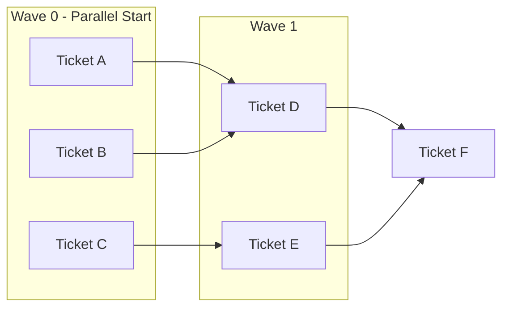

# Methodology: Massive Parallelization with Claude Code

> Conversation memo - Dec 24, 2024

## Concept

Parallelize development by launching multiple Claude Code instances simultaneously, each working on an isolated ticket in its own git worktree.

```
┌─────────────────────────────────────────────────────────────┐
│                      ORCHESTRATOR                           │
│  Task queue → Detect rate limit → Automatic retry           │
└─────────────────────────────────────────────────────────────┘
        │           │           │           │
        ▼           ▼           ▼           ▼
   ┌────────┐  ┌────────┐  ┌────────┐  ┌────────┐
   │Claude 1│  │Claude 2│  │Claude 3│  │Claude 4│
   │WT #177 │  │WT #178 │  │WT #179 │  │WT #180 │
   └────────┘  └────────┘  └────────┘  └────────┘
        │           │           │           │
        ▼           ▼           ▼           ▼
      PR #1       PR #2       PR #3       PR #4
```

**Dev's role**: PR review, feedback, merge. The dev becomes a "tech lead" who supervises.

---

## Prerequisites

### 1. Dependency Graph

Before parallelizing, map dependencies between tickets:



**Tools**:
- Mermaid Live: https://mermaid.live
- GitHub Issues with dependency labels
- `tasks.md` file with explicit dependencies

### 2. Fine-grained Ticket Splitting

Rule: **≤ 3 story points per ticket**

| Bad | Good |
|-----|------|
| "Implement the blocking system" | "Create SirenTier interface" |
| | "Implement AndroidSirenTier" |
| | "Create selectBlockingSchedule selector" |
| | "Create unified listener" |

**Smaller tickets mean**:
- Fewer merge conflicts
- Fewer tokens consumed
- Easier to review
- More parallelizable

### 3. Hyper-specified Tickets

❌ Vague ticket (expensive in tokens):
```markdown
Implement the SirenTier port
```

✅ Precise ticket (saves tokens):
```markdown
## Files to create
- `core/_ports_/siren.tier.ts`

## Exact interface
interface SirenTier {
  initialize(): Promise<void>
  setBlockingSchedule(schedule: BlockingSchedule): Promise<void>
}

## Types to define
- BlockingSchedule { windows: BlockingWindow[] }
- BlockingWindow { id, startTime, endTime, sirens }

## Expected tests
- File: `core/_ports_/siren.tier.spec.ts`
- Cases: initialize success, setBlockingSchedule success

## DO NOT touch
- Other port files
- Infra/
- UI/
```

---

## Workflow

### Phase 1: Preparation

```bash
# 1. Create the epic branch
git checkout -b epic/epic-name main

# 2. Create worktrees for each ticket
git worktree add worktrees/feat-177 -b feat/177-siren-tier epic/epic-name
git worktree add worktrees/feat-178 -b feat/178-siren-lookout epic/epic-name
git worktree add worktrees/feat-179 -b feat/179-select-schedule epic/epic-name

# 3. Create task files
mkdir -p tasks
# Write tasks/177.md, tasks/178.md, etc.
```

### Phase 2: Launching Waves

```bash
# Wave 0 - Tickets with no dependencies
cd worktrees/feat-177 && claude &
cd worktrees/feat-178 && claude &
cd worktrees/feat-179 && claude &

# Wait for wave 0 to be merged

# Wave 1 - Tickets depending on wave 0
cd worktrees/feat-180 && claude &
# ...
```

### Phase 3: Review & Merge

1. **Review the first PR that arrives**
2. If systemic issue found (style, architecture):
   - Update ESLint/ADR on `epic/epic-name`
   - Other PRs will fail their CI
   - Claude detects failure → fixes automatically
3. **Merge when green**
4. Other PRs rebase automatically (or manually)

### Phase 4: Change Propagation

When the epic branch changes:

```bash
# For each active worktree
cd worktrees/feat-XXX
git fetch origin
git rebase epic/epic-name
npm run lint:fix  # Auto-fix what can be fixed
npm test
```

---

## Rate Limit Management

### Problem
With Claude Pro/Max, rate limit can block all instances simultaneously.

### Solution: Orchestration script with retry

```bash
#!/bin/bash
# orchestrate.sh

WORKTREES_DIR="./worktrees"
TASKS_DIR="./tasks"
LOG_DIR="./logs"
RATE_LIMIT_WAIT=300  # 5 min

mkdir -p "$LOG_DIR"

run_instance() {
  local task_id=$1
  local task_file="$TASKS_DIR/${task_id}.md"
  local worktree="$WORKTREES_DIR/feat-${task_id}"
  local log_file="$LOG_DIR/${task_id}.log"

  while true; do
    echo "[$(date)] Starting $task_id" >> "$log_file"

    cd "$worktree"
    claude --print "$(cat $task_file)" >> "$log_file" 2>&1

    # Check rate limit
    if tail -20 "$log_file" | grep -qi "rate.limit\|capacity\|try again"; then
      echo "[$(date)] Rate limited, waiting..." >> "$log_file"
      sleep $RATE_LIMIT_WAIT
      continue
    fi

    # Check if completed
    if tail -50 "$log_file" | grep -qi "pull request\|committed\|completed"; then
      echo "[$(date)] Task $task_id completed" >> "$log_file"
      break
    fi

    sleep 30
  done
}

run_wave() {
  local -a tasks=("$@")
  local pids=()

  for task in "${tasks[@]}"; do
    run_instance "$task" &
    pids+=($!)
    sleep 2  # Stagger startup
  done

  for pid in "${pids[@]}"; do
    wait $pid
  done
}

# MAIN
echo "Wave 0"
run_wave "177" "178" "179"

echo "Wave 1"
run_wave "180" "181" "182"

# etc.
```

### Monitoring

```bash
# Separate terminal - watch logs
watch -n 5 'tail -3 logs/*.log | head -40'

# Or with tmux
tmux new-session -d -s monitor
for log in logs/*.log; do
  tmux split-window -t monitor "tail -f $log"
done
tmux select-layout -t monitor tiled
tmux attach -t monitor
```

---

## Token Optimization

### 1. Pre-compute Context

Before launching instances:

```bash
claude "Generate a CONTEXT.md with:
- Relevant folder structure
- Patterns to follow
- Files NOT to touch
- Naming conventions"
```

Each instance receives this file → no need to re-explore.

### 2. Model Adapted to Task

| Task | Model | Usage |
|------|-------|-------|
| Planning / Analysis | Opus | Complex |
| Standard implementation | Sonnet | Default |
| Lint fix / small tweaks | Haiku | Fast & cheap |

```bash
claude --model sonnet  # For implementation
claude --model haiku   # For quick fixes
```

### 3. Scope Lock per Instance

In each task file:

```markdown
## STRICT SCOPE

You work ONLY on:
- `core/_ports_/siren.tier.ts`
- `core/_ports_/siren.tier.spec.ts`

You DO NOT touch:
- Other files
- If you need to modify something else → STOP and ask
```

### 4. Avoid Expensive Retry Loops

```bash
# Extract JUST the relevant error
npm run lint 2>&1 | grep "error" | head -20 > /tmp/errors.txt
claude --model haiku "Fix these errors: $(cat /tmp/errors.txt)"
```

---

## Conflict Management

### Problem
PR #177 review → update ESLint → PR #178, #179 are now outdated

### Solutions

#### Option A: Review by Wave (recommended)

```
Wave completes → Review all PRs TOGETHER
              → Identify problematic patterns ONCE
              → Update ESLint/ADR on epic branch
              → All PRs rebase + fix → merge together
```

#### Option B: CI as Signal

```
Update ESLint on epic
       ↓
PRs fail their CI on next push
       ↓
Claude sees failure → fixes automatically
       ↓
Merge when green
```

#### Option C: Isolated Files Convention

The real win: each ticket touches DIFFERENT files

| Ticket | Files |
|--------|-------|
| #177 | `core/_ports_/siren.tier.ts` |
| #178 | `core/_ports_/siren.lookout.ts` |
| #179 | `core/block-session/selectors/` |

**Zero overlap = zero conflicts**

---

## Implementation Checklist

### Preparation (once)

- [ ] Create dependency graph (Mermaid)
- [ ] Split tickets (≤ 3 points each)
- [ ] Identify parallelizable waves
- [ ] Write detailed task files (`tasks/*.md`)
- [ ] Setup orchestration script (`orchestrate.sh`)
- [ ] Setup monitoring (tmux or watch)

### Per Epic

- [ ] Create `epic/epic-name` branch
- [ ] Create worktrees for each ticket
- [ ] Verify specs are complete
- [ ] Launch wave 0
- [ ] Review & merge wave 0
- [ ] Propagate changes (rebase)
- [ ] Launch wave 1
- [ ] ...repeat...
- [ ] Merge epic → main

### Per PR (review)

- [ ] Code does what's requested?
- [ ] Tests pass?
- [ ] No systemic style/arch issues?
  - If yes → update ESLint/ADR on epic BEFORE merge
- [ ] Merge
- [ ] Trigger rebase on other PRs if needed

---

## Recommended File Structure

```
project/
├── orchestrate.sh           # Main script
├── tasks/
│   ├── 177.md               # Detailed prompt for #177
│   ├── 178.md
│   ├── 179.md
│   └── ...
├── worktrees/
│   ├── feat-177/            # git worktree
│   ├── feat-178/
│   └── ...
├── logs/
│   ├── 177.log
│   ├── 178.log
│   └── ...
└── docs/
    └── dependency-graph.md  # Mermaid graph
```

---

## Useful Commands

```bash
# Create a worktree
git worktree add worktrees/feat-XXX -b feat/XXX-description epic/epic-name

# List worktrees
git worktree list

# Remove a worktree (after merge)
git worktree remove worktrees/feat-XXX

# Rebase a worktree on epic
cd worktrees/feat-XXX && git rebase epic/epic-name

# See status of all branches
git branch -vv

# Create PR from worktree
cd worktrees/feat-XXX && gh pr create --base epic/epic-name
```

---

## Known Limitations

1. **Shared rate limit** - All instances share the same quota
2. **Semantic conflicts** - Two features may have incompatible assumptions even without touching the same files
3. **Context switching** - Reviewing 5+ PRs in parallel is cognitively intense
4. **Reactive feedback** - Style/arch issues emerge during review, not before

---

## Success Metrics

- **Total time**: Parallel waves vs sequential
- **Merge conflicts**: Target < 1 per wave
- **Rate limit retries**: Monitor to adjust instance count
- **PRs rejected**: If too many → improve specs
